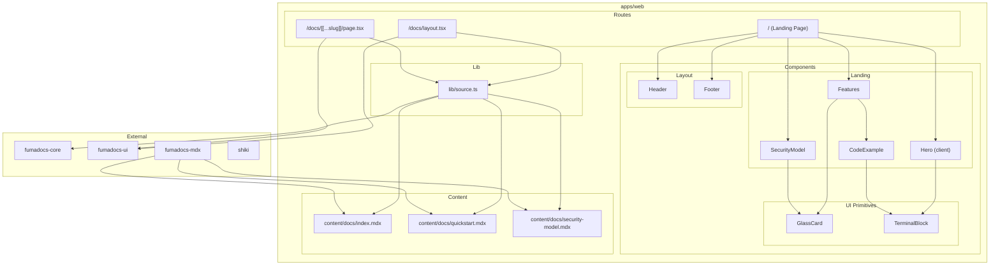
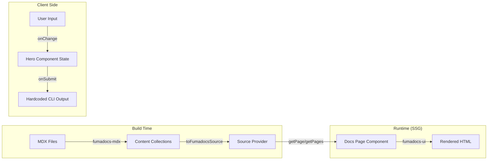

# Design Document: relay Landing Page and Documentation Site

**Date**: 2026-02-20
**Status**: Proposed
**PRD**: [docs/prd.md](/docs/prd.md)
**Complexity Level**: Medium
**Complexity Rationale**: (1) Multiple ACs across landing page sections, interactive terminal with animation states, fumadocs integration with custom theming; (2) fumadocs v16 compatibility with Next.js 16 is assumed but not yet validated in this monorepo, MDX content pipeline introduces a new build dependency.

---

## Agreement Checklist

- **Scope**: Landing page (hero, features, security model sections) + 3 fumadocs documentation pages (Introduction, Quickstart, Security Model)
- **Non-scope**: No backend API, no auth, no blog, no pricing, no additional docs pages, no light mode toggle (Could Have)
- **Constraints**: Must live in existing `apps/web` monorepo workspace; brand guidelines are fixed; docs content is aspirational (CLI not yet implemented); Tailwind v4 `@theme` directive for tokens
- **Performance requirements**: LCP < 2.5s, INP < 200ms, CLS < 0.1, terminal animation at 60fps

Design reflection:
- [x] Scope covered: Landing page sections in `apps/web/src/app/page.tsx`, docs pages under `/docs` route via fumadocs
- [x] Non-scope confirmed: No backend, auth, blog, pricing routes created
- [x] Constraints reflected: All work in `apps/web`, brand tokens in `globals.css`, fumadocs theming via CSS variables
- [x] Performance: SSG for all pages, CSS-driven animations, minimal JS bundle for terminal

---

## Applicable Standards

### Explicit
- `[explicit]` Tailwind CSS v4 with `@theme` directive (observed in `globals.css`)
- `[explicit]` Next.js App Router with TypeScript (observed in `layout.tsx`, `tsconfig.json`)
- `[explicit]` Path alias `@/*` mapped to `./src/*` (observed in `tsconfig.json`)
- `[explicit]` npm workspaces monorepo (observed in root `package.json`)

### Implicit
- `[implicit]` Component files use PascalCase naming (inferred from Next.js convention)
- `[implicit]` CSS custom properties for theming (observed pattern in `globals.css`)
- `[implicit]` `next/font/google` for font loading (observed in `layout.tsx`)

---

## Prerequisite ADRs

### ADR-0001: fumadocs v16 Integration

**Status**: Proposed

**Background**: The documentation site requires a framework for MDX-based docs with navigation, search, and TOC. fumadocs v16 is purpose-built for Next.js App Router and supports Tailwind CSS v4.

**Options**:

| Criteria | fumadocs v16 | Nextra v4 | Custom MDX Pipeline |
|----------|-------------|-----------|-------------------|
| Next.js 16 + App Router | Native support | Partial (pages-focused history) | Manual wiring |
| Tailwind v4 | Built-in CSS variable theming | Requires adaptation | Full control |
| MDX Source Provider | `fumadocs-mdx` with `defineDocs` | Built-in but opinionated | `next-mdx-remote` or `@next/mdx` |
| Navigation/TOC/Sidebar | Included in `fumadocs-ui` | Included | Must build from scratch |
| Maintenance burden | Low (3 packages) | Low | High |
| Theming flexibility | CSS variables (`--color-fd-*`) | Theme config | Full control |
| Implementation effort | 1 day | 1-2 days | 3-5 days |

**Decision**: fumadocs v16. It provides native Next.js 16 + App Router support, built-in navigation primitives (sidebar, TOC, breadcrumbs), and CSS variable-based theming that maps cleanly to the relay brand palette. The source provider pattern (`fumadocs-mdx` with `defineDocs`) keeps MDX content in `apps/web/content/docs/` with minimal configuration.

**Implementation Guideline**: Use CSS variable overrides (`--color-fd-background`, `--color-fd-foreground`, etc.) to apply relay brand theming rather than forking fumadocs components.

---

## Existing Codebase Analysis

### Implementation Path Mapping

**Existing files** (will be modified):
- `apps/web/src/app/layout.tsx` -- Replace Geist fonts with JetBrains Mono, wrap with fumadocs RootProvider
- `apps/web/src/app/globals.css` -- Replace theme tokens with relay brand palette, add fumadocs CSS import, add glass effect utilities
- `apps/web/src/app/page.tsx` -- Replace boilerplate with landing page (Hero, Features, SecurityModel, Footer)
- `apps/web/next.config.ts` -- Add fumadocs MDX plugin via `createMDX`
- `apps/web/package.json` -- Add fumadocs and shiki dependencies
- `apps/web/tsconfig.json` -- Add MDX file includes if needed

**New files** (planned):
- `apps/web/src/app/docs/layout.tsx` -- fumadocs DocsLayout wrapper
- `apps/web/src/app/docs/[[...slug]]/page.tsx` -- fumadocs dynamic doc page
- `apps/web/src/lib/source.ts` -- fumadocs source provider config
- `apps/web/src/components/ui/glass-card.tsx` -- Glass card primitive
- `apps/web/src/components/ui/terminal-block.tsx` -- Terminal display primitive
- `apps/web/src/components/landing/hero.tsx` -- Interactive terminal hero (client component)
- `apps/web/src/components/landing/features.tsx` -- Features section
- `apps/web/src/components/landing/security-model.tsx` -- Security model section
- `apps/web/src/components/landing/code-example.tsx` -- CLI code block with optional copy
- `apps/web/src/components/layout/header.tsx` -- Site header/nav
- `apps/web/src/components/layout/footer.tsx` -- Site footer
- `apps/web/content/docs/index.mdx` -- Introduction doc
- `apps/web/content/docs/quickstart.mdx` -- Quickstart doc
- `apps/web/content/docs/security-model.mdx` -- Security Model doc
- `apps/web/content/docs/meta.json` -- fumadocs page ordering

### Similar Functionality Search

No existing documentation framework, component library, or landing page implementation found. The current `page.tsx` is the default Next.js boilerplate. **Decision**: New implementation following existing project patterns (Tailwind v4 `@theme`, `next/font/google`, App Router conventions).

### Code Inspection Evidence

| File | Relevance |
|------|-----------|
| `apps/web/src/app/layout.tsx` | Integration point -- font loading, metadata, body class |
| `apps/web/src/app/globals.css` | Integration point -- theme tokens, Tailwind config |
| `apps/web/src/app/page.tsx` | Replacement target -- current boilerplate |
| `apps/web/next.config.ts` | Integration point -- MDX plugin registration |
| `apps/web/tsconfig.json` | Pattern reference -- path aliases, compiler options |
| `apps/web/package.json` | Integration point -- dependency management |

---

## Architecture

### Architecture Diagram



### Data Flow Diagram



---

## Design System

### Brand Tokens (Tailwind v4 @theme)

The existing `globals.css` `@theme` block will be replaced with relay brand tokens:

```css
@import "tailwindcss";
@import "fumadocs-ui/css/neutral.css";
@import "fumadocs-ui/css/preset.css";

:root {
  --background: #0a0a0a;
  --foreground: #ededed;
  --muted: #888888;
  --accent: #4a9fc7;
  --glass-bg: rgba(255, 255, 255, 0.05);
  --glass-border: rgba(255, 255, 255, 0.1);
  --glass-blur: 12px;

  /* fumadocs theme overrides */
  --color-fd-background: #0a0a0a;
  --color-fd-foreground: #ededed;
  --color-fd-muted: #888888;
  --color-fd-muted-foreground: #666666;
  --color-fd-border: rgba(255, 255, 255, 0.1);
  --color-fd-accent: #4a9fc7;
  --color-fd-accent-foreground: #ededed;
}

@theme inline {
  --color-background: var(--background);
  --color-foreground: var(--foreground);
  --color-muted: var(--muted);
  --color-accent: var(--accent);
  --color-glass-bg: var(--glass-bg);
  --color-glass-border: var(--glass-border);
  --font-mono: var(--font-jetbrains-mono), "Fira Code", "SF Mono", "Cascadia Code", monospace;
}
```

### Typography

Replace Geist fonts with JetBrains Mono in `layout.tsx`:

```tsx
import { JetBrains_Mono } from "next/font/google";

const jetbrainsMono = JetBrains_Mono({
  variable: "--font-jetbrains-mono",
  subsets: ["latin"],
});
```

All body text uses monospace. No sans-serif font is loaded (brand spec: "monospace everywhere").

### UI Primitives

**GlassCard**: Server component. Semi-transparent background + `backdrop-blur` + subtle border. Accepts `children`, optional `className`.

```tsx
// apps/web/src/components/ui/glass-card.tsx
export function GlassCard({ children, className }: { children: React.ReactNode; className?: string }) {
  return (
    <div className={`bg-glass-bg border border-glass-border backdrop-blur-[12px] p-6 ${className ?? ""}`}>
      {children}
    </div>
  );
}
```

**TerminalBlock**: Server component. Dark background, monospace, `$` or `>` prefix rendering. Accepts `lines: Array<{ prefix: string; text: string }>` and optional `className`.

**Button**: Minimal flat button with sharp corners (`rounded-none` or `rounded-sm`), monospace text. No `rounded-full` per brand spec.

---

## Component Design

### Hero (Client Component)

**File**: `apps/web/src/components/landing/hero.tsx`
**Directive**: `"use client"`

**States** (3 states):
1. `animating` -- Typing animation plays the three prompt lines sequentially
2. `idle` -- Animation complete, input field active, awaiting user input
3. `responded` -- User submitted input, hardcoded CLI output displayed

**Animation approach**:
- CSS `@keyframes` for the typing cursor blink
- `requestAnimationFrame`-based character-by-character reveal for each prompt line
- Total animation duration: ~3.5 seconds (within 4-second AC)
- Three lines animate sequentially:
  - `> create an external agent`
  - `> that can talk to users`
  - `> without touching my system`

**Interactive input**:
- Renders after animation completes
- Styled as terminal input: `$ describe your use case...` placeholder
- On submit (Enter key), transitions to `responded` state
- Response is a hardcoded structured CLI output block showing relay capabilities

**Hardcoded response structure**:
```
relay v0.1.0 — analyzing use case...

  objective:    "{user input truncated}"
  channels:     [whatsapp, voice]
  isolation:    strict — no code exec, no file access
  output:       structured JSON via `relay pull`

  $ relay interview start --objective="..."
  > session ready. relay is isolated. your system is untouched.
```

**Reduced motion**: Respects `prefers-reduced-motion` by skipping character animation and showing all lines immediately.

### Features Section

**File**: `apps/web/src/components/landing/features.tsx`

Server component. Renders a grid of GlassCards, each containing:
- Feature name (e.g., "Interviews", "Group Interviews", "Pull Command", "Logging")
- One-sentence description
- CLI code example in a TerminalBlock

Data is a static array defined in the component file. No props required.

### SecurityModel Section

**File**: `apps/web/src/components/landing/security-model.tsx`

Server component. Two visual areas:
1. "Hard Constraints" list (no file access, no code execution, no internal APIs, no role escalation)
2. "Structured Data Bridge" showing the JSON schema from the brand spec in a TerminalBlock

### CodeExample

**File**: `apps/web/src/components/landing/code-example.tsx`

Server component wrapping a TerminalBlock with optional copy-to-clipboard button (Should Have -- implement if time permits, otherwise omit the button).

### Header

**File**: `apps/web/src/components/layout/header.tsx`

Server component. Contains:
- `relay` logo text (monospace, lowercase)
- Navigation: "Docs" link pointing to `/docs`
- Minimal, no hamburger menu on mobile (links stack or hide)

### Footer

**File**: `apps/web/src/components/layout/footer.tsx`

Server component. Minimal: copyright line, "Built with relay" text.

---

## fumadocs Integration

### Dependencies

```json
{
  "fumadocs-core": "^16",
  "fumadocs-ui": "^16",
  "fumadocs-mdx": "^14",
  "shiki": "^3"
}
```

### next.config.ts

```ts
import { createMDX } from "fumadocs-mdx/next";

const withMDX = createMDX();

const nextConfig: NextConfig = {
  // existing config
};

export default withMDX(nextConfig);
```

### Source Provider

```ts
// apps/web/src/lib/source.ts
import { docs } from "@/.source";
import { loader } from "fumadocs-core/source";

export const source = loader({
  source: docs.toFumadocsSource(),
});
```

Note: fumadocs-mdx v14 generates a `.source` directory. Add `"@/.source"` path alias to `tsconfig.json`:
```json
{
  "compilerOptions": {
    "paths": {
      "@/*": ["./src/*"],
      "@/.source": ["./.source"]
    }
  }
}
```

Create `source.config.ts` at project root:
```ts
import { defineDocs } from "fumadocs-mdx/config";

export const docs = defineDocs({
  dir: "content/docs",
});
```

### Docs Layout

```tsx
// apps/web/src/app/docs/layout.tsx
import { DocsLayout } from "fumadocs-ui/layouts/docs";
import { source } from "@/lib/source";
import type { ReactNode } from "react";

export default function Layout({ children }: { children: ReactNode }) {
  return (
    <DocsLayout tree={source.pageTree}>
      {children}
    </DocsLayout>
  );
}
```

### Docs Page

```tsx
// apps/web/src/app/docs/[[...slug]]/page.tsx
import { source } from "@/lib/source";
import { DocsPage, DocsBody } from "fumadocs-ui/page";
import { notFound } from "next/navigation";

export default async function Page(props: { params: Promise<{ slug?: string[] }> }) {
  const params = await props.params;
  const page = source.getPage(params.slug);
  if (!page) notFound();

  const MDX = page.data.body;

  return (
    <DocsPage toc={page.data.toc}>
      <DocsBody>
        <MDX />
      </DocsBody>
    </DocsPage>
  );
}

export function generateStaticParams() {
  return source.generateParams();
}
```

### Root Layout Update

```tsx
// apps/web/src/app/layout.tsx
import { JetBrains_Mono } from "next/font/google";
import { RootProvider } from "fumadocs-ui/provider/next";
import "./globals.css";

const jetbrainsMono = JetBrains_Mono({
  variable: "--font-jetbrains-mono",
  subsets: ["latin"],
});

export const metadata = {
  title: "relay",
  description: "A separate agent for talking with the real world.",
};

export default function RootLayout({ children }: { children: React.ReactNode }) {
  return (
    <html lang="en" className="dark" suppressHydrationWarning>
      <body className={`${jetbrainsMono.variable} font-mono antialiased`}>
        <RootProvider>
          {children}
        </RootProvider>
      </body>
    </html>
  );
}
```

### MDX Content Structure

```
apps/web/content/docs/
  meta.json          -- page ordering: ["index", "quickstart", "security-model"]
  index.mdx          -- Introduction
  quickstart.mdx     -- Quickstart
  security-model.mdx -- Security Model
```

Each MDX file uses fumadocs frontmatter:
```yaml
---
title: Introduction
description: What relay is and the problem it solves.
---
```

---

## File Structure Summary

```
apps/web/
  content/
    docs/
      meta.json
      index.mdx
      quickstart.mdx
      security-model.mdx
  src/
    app/
      layout.tsx              (modified)
      globals.css             (modified)
      page.tsx                (modified -- landing page)
      docs/
        layout.tsx            (new)
        [[...slug]]/
          page.tsx            (new)
    components/
      ui/
        glass-card.tsx        (new)
        terminal-block.tsx    (new)
      landing/
        hero.tsx              (new)
        features.tsx          (new)
        security-model.tsx    (new)
        code-example.tsx      (new)
      layout/
        header.tsx            (new)
        footer.tsx            (new)
    lib/
      source.ts               (new)
  next.config.ts              (modified)
  package.json                (modified)
```

---

## Integration Point Map

```yaml
Integration Point 1:
  Existing Component: apps/web/src/app/layout.tsx (RootLayout)
  Integration Method: Replace fonts, wrap children with fumadocs RootProvider
  Impact Level: High (all pages affected)
  Required Test Coverage: Verify landing page and docs pages both render correctly

Integration Point 2:
  Existing Component: apps/web/next.config.ts
  Integration Method: Wrap config with createMDX from fumadocs-mdx
  Impact Level: High (build pipeline change)
  Required Test Coverage: Verify build succeeds, MDX files are processed

Integration Point 3:
  Existing Component: apps/web/src/app/globals.css
  Integration Method: Replace theme tokens, add fumadocs CSS imports
  Impact Level: High (all styling affected)
  Required Test Coverage: Verify brand colors render correctly on landing and docs

Integration Point 4:
  Existing Component: apps/web/src/app/page.tsx
  Integration Method: Full replacement of boilerplate with landing page
  Impact Level: Medium (single page, no downstream consumers)
  Required Test Coverage: Visual verification of all landing sections
```

### Integration Boundary Contracts

```yaml
Landing Page <-> UI Primitives:
  Input: React props (children, className, lines array)
  Output: Rendered JSX (sync)
  On Error: React error boundary catches rendering failures

Source Provider <-> MDX Content:
  Input: MDX files in content/docs/ with valid frontmatter
  Output: Page objects with body, toc, metadata (sync at build time)
  On Error: Build fails with clear error if MDX is malformed

Docs Layout <-> fumadocs-ui:
  Input: source.pageTree (generated page tree)
  Output: Sidebar navigation, TOC, breadcrumbs (sync SSG)
  On Error: 404 page via notFound() if slug does not match any page
```

---

## Change Impact Map

```yaml
Change Target: apps/web/src/app/layout.tsx (RootLayout)
Direct Impact:
  - apps/web/src/app/layout.tsx (font swap, RootProvider wrap)
  - apps/web/src/app/page.tsx (font class change affects typography)
  - apps/web/src/app/docs/layout.tsx (inherits RootProvider)
Indirect Impact:
  - All pages get dark mode default and monospace typography
No Ripple Effect:
  - apps/cli (separate workspace, unaffected)
  - Root package.json (no changes needed)

Change Target: apps/web/next.config.ts (MDX plugin)
Direct Impact:
  - apps/web/next.config.ts (createMDX wrapper)
Indirect Impact:
  - Build process now processes .mdx files
No Ripple Effect:
  - Existing .tsx pages are unaffected by MDX plugin
  - apps/cli build pipeline is independent

Change Target: apps/web/src/app/globals.css (theme tokens)
Direct Impact:
  - apps/web/src/app/globals.css (complete token replacement)
  - All components using Tailwind color utilities
Indirect Impact:
  - fumadocs components inherit --color-fd-* overrides
No Ripple Effect:
  - No other workspace consumes these CSS variables
```

---

## Interface Change Matrix

| Existing Operation | New Operation | Conversion Required | Adapter Required | Compatibility Method |
|-------------------|---------------|-------------------|------------------|---------------------|
| `RootLayout` (Geist fonts, no provider) | `RootLayout` (JetBrains Mono, RootProvider) | Yes | Not Required | Direct replacement |
| `globals.css` (light/dark tokens) | `globals.css` (dark-only relay tokens + fumadocs imports) | Yes | Not Required | Direct replacement |
| `page.tsx` (Next.js boilerplate) | `page.tsx` (relay landing page) | Yes | Not Required | Direct replacement |
| `next.config.ts` (empty config) | `next.config.ts` (createMDX wrapper) | Yes | Not Required | Additive wrapping |
| N/A | `/docs` route (fumadocs) | N/A | N/A | New route, no conflict |

---

## Implementation Approach

**Strategy**: Vertical Slice

**Rationale**: Each deliverable (landing page, docs site) provides standalone user value. The landing page can be built and verified independently from the docs integration. Low inter-feature dependencies (shared only through layout and CSS tokens). Early value delivery: a working landing page is useful even before docs are wired.

**Task order**:
1. Foundation: Dependencies, `globals.css` tokens, `layout.tsx` font/provider, `next.config.ts` MDX plugin
2. UI Primitives: GlassCard, TerminalBlock
3. Landing Page: Hero, Features, SecurityModel, Header, Footer, assemble in `page.tsx`
4. Docs Site: Source provider, docs layout, docs page, MDX content files
5. Polish: Responsive verification, reduced-motion, copy-to-clipboard (Should Have)

**Verification levels**:
- Task 1-2: L3 (build succeeds)
- Task 3: L1 (landing page renders correctly at all breakpoints)
- Task 4: L1 (all 3 docs pages navigable with sidebar/TOC)
- Task 5: L1 (responsive, accessible)

---

## Acceptance Criteria (mapped to PRD Must-Haves)

### AC-1: Interactive Terminal Hero
- [ ] Hero section displays three prompt lines animating character-by-character on page load
- [ ] Animation completes within 4 seconds
- [ ] After animation, an input field with `$ describe your use case...` placeholder is active
- [ ] Submitting input renders a hardcoded structured CLI response
- [ ] Respects `prefers-reduced-motion` (no character animation, immediate display)

### AC-2: Features Section
- [ ] Displays at least 4 relay capabilities (interviews, group interviews, pull command, logging)
- [ ] Each feature shows its CLI invocation in a monospace code block
- [ ] Features are presented in GlassCard components

### AC-3: Security Model Section
- [ ] Lists hard constraints: no file access, no code execution, no internal APIs, no role escalation
- [ ] Displays the structured data bridge JSON schema

### AC-4: Glass + Terminal Visual Design
- [ ] Background is near-black (#0a0a0a)
- [ ] Glass card components use semi-transparent bg + backdrop-blur + rgba border
- [ ] All typography uses JetBrains Mono (monospace)
- [ ] No bright saturated colors; accent is muted blue/cyan only on interactive elements
- [ ] No rounded-full pills; buttons and cards use sharp or slightly rounded corners

### AC-5: Documentation Site (3 pages)
- [ ] `/docs` route renders Introduction page with fumadocs navigation (sidebar, TOC)
- [ ] `/docs/quickstart` page documents CLI interface with example commands
- [ ] `/docs/security-model` page details capability isolation and data bridge schema
- [ ] All docs pages use relay brand theming (dark background, monospace, muted palette)

### AC-6: Responsive Layout
- [ ] Landing page renders correctly at 360px, 768px, and 1280px+ widths
- [ ] Terminal hero is functional and readable at all breakpoints
- [ ] Docs pages are navigable on mobile (fumadocs responsive sidebar)

---

## E2E Verification Procedures

### Phase 1: Foundation
- `npm run build -w apps/web` succeeds with fumadocs-mdx plugin active
- No TypeScript errors in modified files

### Phase 2: UI Primitives
- GlassCard renders with correct backdrop-blur and border styling (visual check)
- TerminalBlock renders monospace lines with correct prefixes (visual check)

### Phase 3: Landing Page
- Navigate to `/` -- Hero animation plays, input becomes active, submit shows response
- Scroll through Features section -- 4 feature cards with CLI examples visible
- Scroll to Security Model section -- constraints list and JSON schema visible
- Check at 360px, 768px, 1280px viewport widths

### Phase 4: Documentation Site
- Navigate to `/docs` -- Introduction page renders with sidebar showing 3 pages
- Click "Quickstart" in sidebar -- page loads with CLI examples
- Click "Security Model" in sidebar -- page loads with constraints detail
- TOC renders on desktop, sidebar collapses on mobile

### Phase 5: Polish
- Enable `prefers-reduced-motion` in browser -- hero shows all lines immediately
- Lighthouse audit on landing page -- performance score 90+

---

## Data Representation Decision

No new persistent data structures are introduced. All content is static:
- Landing page data is hardcoded in component files (feature list, security constraints, hero response)
- Documentation content lives in MDX files processed at build time by fumadocs-mdx

No database, API, or runtime data storage. **Decision**: No new data structures required.

---

## Non-Functional Requirements

| Requirement | Target | Verification Method |
|-------------|--------|-------------------|
| LCP | < 2.5s | Lighthouse audit |
| INP | < 200ms | Lighthouse audit |
| CLS | < 0.1 | Lighthouse audit |
| Terminal animation FPS | 60fps | Chrome DevTools Performance tab |
| Availability | 99.9% | Vercel hosting SLA |
| Bundle size | Minimal JS (hero is only client component) | `next build` output analysis |

---

## Error Handling

- **MDX parse errors**: fumadocs-mdx surfaces build-time errors with file path and line number. No runtime fallback needed.
- **Missing docs page**: `notFound()` returns 404 via Next.js. fumadocs source provider returns `undefined` for unknown slugs.
- **Hero animation failure**: If `requestAnimationFrame` is unavailable (SSR), the component renders all lines statically (server render shows final state, client hydrates with animation).
- **Font loading failure**: `next/font/google` provides fallback to system monospace via the font stack declaration.

---

## Test Strategy

Given this is a static marketing site with no business logic or data persistence:

- **Visual regression**: Manual verification at 3 breakpoints (360px, 768px, 1280px+)
- **Build verification**: `npm run build -w apps/web` must succeed (catches MDX errors, TypeScript errors, import issues)
- **Lighthouse**: Automated performance audit targeting 90+ score
- **Accessibility**: fumadocs provides accessible navigation out of the box; verify `prefers-reduced-motion` on hero

No unit tests are warranted for static server components rendering hardcoded data. The hero client component could be unit-tested for state transitions but the ROI is low given the 3-state simplicity.

---

## References

- [Fumadocs v16 Blog Post](https://www.fumadocs.dev/blog/v16) -- Breaking changes and migration guide for v16
- [Fumadocs Quick Start](https://www.fumadocs.dev/docs) -- Installation and setup guide
- [Fumadocs Themes](https://www.fumadocs.dev/docs/ui/theme) -- CSS variable customization for dark mode and brand theming
- [Fumadocs Next.js MDX Setup](https://www.fumadocs.dev/docs/mdx/next) -- Source provider pattern with createMDX
- [Fumadocs Manual Installation](https://www.fumadocs.dev/docs/ui/manual-installation) -- Manual setup for existing Next.js projects
- [relay Brand Reference](/.claude/skills/relay-brand/references/brand.md) -- Visual identity, tone, and component patterns
