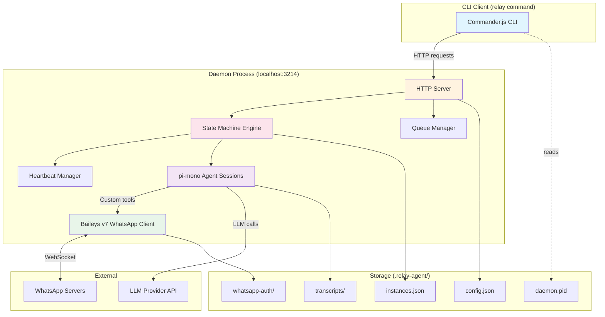
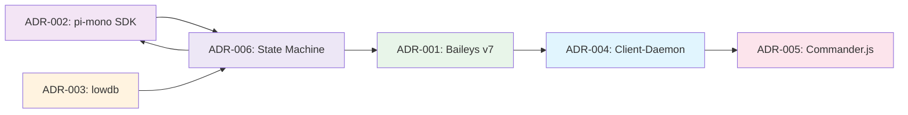

# Architecture Decision Records: Relay Agent CLI

*Date: 2026-02-20*
*Status: Proposed*
*PRD Reference: [docs/plans/prd.md](./prd.md)*

---

## ADR-001: WhatsApp Integration via Baileys v7 RC

### Status

Proposed

### Context

Relay Agent requires programmatic WhatsApp messaging to mediate conversations between a Main Agent (AI) and real-world humans. There is no free official WhatsApp API for this use case. The system needs to send/receive messages, handle QR code authentication, and maintain a persistent WebSocket connection. WhatsApp Business API exists but targets businesses with approval processes and per-message costs.

### Decision

Use `@whiskeysockets/baileys` v7.0.0-rc.9 for WhatsApp Web socket API integration.

#### Decision Details

| Item | Content |
|------|---------|
| **Decision** | Adopt Baileys v7 RC as the WhatsApp messaging layer |
| **Why now** | Baileys v7 is the latest available version with active development; v6 is in maintenance mode |
| **Why this** | Only viable open-source, free, WebSocket-based WhatsApp Web library with TypeScript support and multi-device compatibility |
| **Known unknowns** | RC stability (v7 has not reached stable release), WhatsApp protocol changes may break functionality without notice |
| **Kill criteria** | WhatsApp actively blocks Baileys connections making the library unusable, or the project is abandoned without a stable v7 release |

### Rationale

#### Options Considered

1. **WhatsApp Business API (Official)**
   - Pros: Official support, stable, compliant with WhatsApp ToS, webhook-based message delivery
   - Cons: Requires business verification and approval, per-message pricing (conversations billed), hosted infrastructure needed, not suitable for a local CLI tool
   - Effort: 5+ days (approval process alone can take weeks)

2. **Twilio WhatsApp API**
   - Pros: Well-documented, reliable, managed service, official WhatsApp Business API partner
   - Cons: Per-message cost ($0.005-$0.05+), requires Twilio account and WhatsApp Business approval, adds external service dependency, not local-first
   - Effort: 3 days

3. **@whiskeysockets/baileys v7.0.0-rc.9 (Selected)**
   - Pros: Free, open-source (22k+ GitHub stars), TypeScript-native, WebSocket-based (no browser needed), QR code auth, multi-device support, active community, works locally
   - Cons: Unofficial (WhatsApp ToS risk), RC version (potential instability), reverse-engineered protocol (may break), no guaranteed support
   - Effort: 2 days

4. **Custom WhatsApp Web Protocol Implementation**
   - Pros: Full control, no external dependency
   - Cons: Enormous effort, protocol reverse-engineering required, maintenance burden, fragile
   - Effort: 30+ days

#### Comparison

| Evaluation Axis | WhatsApp Business API | Twilio | Baileys v7 RC | Custom Implementation |
|-----------------|----------------------|--------|---------------|----------------------|
| Cost | Per-message billing | Per-message billing | Free | Free |
| Implementation Effort | 5+ days + approval | 3 days | 2 days | 30+ days |
| Local-first | No (cloud required) | No (cloud required) | Yes | Yes |
| Stability | High | High | Medium (RC) | Low |
| WhatsApp ToS Compliance | Full | Full | Violation risk | Violation risk |
| TypeScript Support | Via REST SDK | Via REST SDK | Native | N/A |
| Maintenance Burden | Low | Low | Medium | Very High |

### Consequences

#### Positive Consequences

- Zero cost for messaging, aligned with local CLI tool philosophy
- Native TypeScript types and WebSocket integration
- Active community with frequent updates (9 RC releases for v7)
- No cloud infrastructure dependency

#### Negative Consequences

- WhatsApp may block accounts using unofficial APIs; users must accept this risk with informed consent
- RC version may have breaking changes before stable release
- Protocol changes by WhatsApp can break functionality at any time
- No SLA or official support channel

#### Neutral Consequences

- Need to implement an abstraction layer over Baileys to isolate the rest of the system from API changes
- QR code authentication flow must be handled in the terminal

### Implementation Guidance

- Wrap Baileys behind an interface/abstraction layer so the messaging implementation can be swapped without affecting the rest of the system
- Pin the exact Baileys version in package.json (no caret or tilde ranges for RC versions)
- Implement reconnection logic with exponential backoff for transient disconnections
- Store auth state in `.relay-agent/` directory for session persistence across daemon restarts

---

## ADR-002: Agent Runtime via pi-mono SDK

### Status

Proposed

### Context

Each ConversationInstance needs an isolated LLM agent session that can use conversation-scoped tools (send_message, mark_todo_item, end_conversation, schedule_next_heartbeat) while being strictly sandboxed from the host system. The agent runtime must support custom tool registration and provide an SDK for programmatic embedding.

### Decision

Use `@mariozechner/pi-coding-agent` (pi-mono SDK) for agent sessions with custom tool definitions.

#### Decision Details

| Item | Content |
|------|---------|
| **Decision** | Use pi-mono SDK's `createAgentSession` for conversation agent runtime |
| **Why now** | The project requires an embeddable agent runtime from day one; this is a core dependency |
| **Why this** | pi-mono provides an SDK mode with custom tool registration, session isolation, and TypeScript support out of the box |
| **Known unknowns** | How pi-mono handles session reconstruction from persisted transcript history on daemon restart; token usage patterns for long conversations |
| **Kill criteria** | pi-mono SDK does not support restricting default tools (read, write, edit, bash) or the API changes in a way that prevents custom-tool-only sessions |

### Rationale

#### Options Considered

1. **LangChain.js**
   - Pros: Large ecosystem, many integrations, well-documented, agent + tool abstractions
   - Cons: Heavy dependency tree, over-engineered for this use case, abstractions add complexity, frequent breaking changes between versions
   - Effort: 4 days

2. **Vercel AI SDK**
   - Pros: Lightweight, streaming support, good TypeScript types, active development
   - Cons: Primarily designed for web/streaming UI use cases, tool calling support is more oriented toward chat completion patterns than autonomous agent loops
   - Effort: 3 days

3. **@mariozechner/pi-coding-agent (Selected)**
   - Pros: SDK mode with `createAgentSession`, custom tool registration, session isolation, TypeScript-native, minimal API surface, designed for embedding
   - Cons: Smaller community than LangChain/Vercel, dependency on pi-mono ecosystem, less documentation
   - Effort: 2 days

4. **Custom Agent Implementation (direct LLM API calls)**
   - Pros: Full control, no framework dependency, minimal bundle size
   - Cons: Must implement tool calling loop, context management, error handling, retry logic from scratch
   - Effort: 7+ days

#### Comparison

| Evaluation Axis | LangChain.js | Vercel AI SDK | pi-mono SDK | Custom |
|-----------------|-------------|---------------|-------------|--------|
| Custom Tool Registration | Yes | Yes | Yes | Manual |
| Session Isolation | Manual setup | Manual setup | Built-in | Manual |
| Dependency Weight | Heavy | Light | Medium | None |
| Agent Loop Built-in | Yes | Partial | Yes | No |
| TypeScript Support | Good | Excellent | Native | N/A |
| Learning Curve | High | Medium | Low | High |

### Consequences

#### Positive Consequences

- One session per ConversationInstance with built-in isolation
- Custom tool registration allows defining exactly the tools available to the conversation agent
- SDK mode designed for embedding, not just CLI usage

#### Negative Consequences

- Dependency on pi-mono ecosystem and its release cadence
- Smaller community means fewer examples and community support
- Default tools (read, write, edit, bash) are overridden by passing only the conversation-scoped tools to `createAgentSession`, which replaces the default tool set entirely

#### Neutral Consequences

- Agent sessions are reconstructed from persisted state on daemon restart (exact reconstruction strategy is an undetermined item in the PRD)

### Implementation Guidance

- Use `createAgentSession` passing only the conversation-scoped tools array, which overrides the default tool discovery and replaces read/write/edit/bash with the custom tool set
- Each ConversationInstance gets its own session; sessions must not share state
- Inject conversation context (objective, todo list, transcript) as system prompt context when creating or reconstructing a session
- Use dependency injection for the agent session factory to enable testing with mock agents

---

## ADR-003: Local JSON Storage via lowdb

### Status

Proposed

### Context

Relay Agent needs local persistence for configuration, conversation instances, transcripts, and WhatsApp auth state. The system is designed as a local CLI tool (single-machine, single-operator). Storage must be simple, debuggable (human-readable), and require no external database server. All state lives in the `.relay-agent/` directory.

### Decision

Use `lowdb` for all persistent storage as JSON files in the `.relay-agent/` directory.

#### Decision Details

| Item | Content |
|------|---------|
| **Decision** | Use lowdb as the JSON file persistence layer for all Relay state |
| **Why now** | Persistence is foundational; all features depend on it |
| **Why this** | Simplest option that meets local-first JSON storage requirements with zero infrastructure |
| **Known unknowns** | Performance characteristics with 10+ concurrent instances each writing state; behavior under unexpected process termination (partial writes) |
| **Kill criteria** | Data corruption occurs under normal operation, or write latency exceeds 500ms for typical state updates |

### Rationale

#### Options Considered

1. **better-sqlite3 (SQLite)**
   - Pros: ACID transactions, concurrent read support, excellent query performance, battle-tested, single-file database
   - Cons: Requires native compilation (node-gyp), binary dependency complicates installation, not human-readable, overkill for <100 records
   - Effort: 3 days

2. **NeDB**
   - Pros: MongoDB-like API, in-memory with disk persistence, indexing support
   - Cons: Unmaintained (last publish 2016), no ESM support, known memory leak issues with large datasets
   - Effort: 2 days

3. **lowdb (Selected)**
   - Pros: Simple API, human-readable JSON files (easy debugging), zero native dependencies, ESM support, well-maintained (22k+ GitHub stars), perfect for CLIs and small tools
   - Cons: Entire DB loaded into memory, no concurrent write safety, `JSON.stringify` on every write, no indexing or query engine
   - Effort: 1 day

4. **Plain fs read/write (manual JSON)**
   - Pros: Zero dependencies, full control, simplest possible approach
   - Cons: Must handle atomic writes manually, no data integrity guarantees, must implement read/write locking, error-prone serialization
   - Effort: 2 days (with proper error handling)

#### Comparison

| Evaluation Axis | SQLite | NeDB | lowdb | Plain fs |
|-----------------|--------|------|-------|----------|
| Setup Complexity | High (native deps) | Low | Very Low | None |
| Human-Readable Storage | No | No | Yes (JSON) | Yes (JSON) |
| Concurrent Write Safety | Yes (ACID) | Partial | No | No |
| Maintenance Status | Active | Abandoned | Stable (infrequent releases) | N/A |
| Query Performance | Excellent | Good | Linear scan | Linear scan |
| Native Dependencies | Yes | No | No | No |
| Suitable for <100 records | Overkill | Yes | Yes | Yes |

### Consequences

#### Positive Consequences

- Human-readable JSON files make debugging trivial (inspect with any text editor or `cat`)
- Zero native dependencies, simplifying installation across platforms
- Minimal learning curve; API is essentially object manipulation + `db.write()`
- Aligns with the v1 single-machine, single-operator constraint

#### Negative Consequences

- No concurrent write safety; only one process should write at a time (single daemon is the writer)
- Full database serialized on every write (acceptable for small datasets)
- No built-in backup or corruption recovery mechanisms
- Performance degrades with large JSON files (irrelevant for v1 scale of <100 instances)

#### Neutral Consequences

- Future migration to SQLite or a proper database is straightforward since lowdb data is plain JSON
- Storage file structure in `.relay-agent/` should be documented for potential future migration

### Implementation Guidance

- Organize storage into separate files by concern: `config.json`, `instances.json`, `transcripts/` directory
- The daemon process is the sole writer; CLI client reads state only through the daemon's HTTP API
- Flush state to disk on every meaningful state transition (not just on shutdown)
- Implement a storage abstraction interface so the persistence layer can be swapped in future versions

---

## ADR-004: Client-Daemon Architecture with HTTP IPC

### Status

Proposed

### Context

Relay requires a persistent WhatsApp WebSocket connection and heartbeat timers that run continuously in the background. CLI commands need to interact with this running service to create instances, check status, send messages, etc. The system must support a workflow where the Main Agent (AI) issues shell commands and parses stdout.

### Decision

Implement a background daemon running an HTTP server on `localhost:3214`, with the CLI client communicating via HTTP requests.

#### Decision Details

| Item | Content |
|------|---------|
| **Decision** | Use a client-daemon architecture with HTTP IPC on localhost:3214 |
| **Why now** | The persistent connection requirement makes a long-running process mandatory from day one |
| **Why this** | HTTP is debuggable (curl), universally understood, and trivially parseable by both humans and the Main Agent |
| **Known unknowns** | Port 3214 availability on target machines; daemon lifecycle management edge cases (orphan processes, stale PID files) |
| **Kill criteria** | HTTP overhead introduces unacceptable latency (>500ms per command), or port conflicts become a recurring issue |

### Rationale

#### Options Considered

1. **Unix Domain Sockets**
   - Pros: Faster than TCP (no network stack overhead), no port conflicts, file-based (auto-cleanup on process exit with some OS)
   - Cons: Harder to debug (no curl), platform differences (Windows compatibility), less familiar to developers, harder for Main Agent to interact with
   - Effort: 3 days

2. **Single-Process CLI (no daemon)**
   - Pros: Simplest architecture, no IPC needed, no daemon lifecycle management
   - Cons: WhatsApp connection must be re-established on every command (slow), no persistent heartbeat timers, no background message receiving, fundamentally incompatible with requirements
   - Effort: N/A (does not meet requirements)

3. **HTTP on localhost:3214 (Selected)**
   - Pros: Debuggable with curl, universally understood protocol, JSON request/response, easy to parse in shell scripts, familiar to developers, works on all platforms
   - Cons: TCP overhead (negligible for local), port conflicts possible, slightly more complex than Unix sockets for pure IPC
   - Effort: 2 days

4. **File-based IPC (command files + polling)**
   - Pros: Very simple, no network needed, works everywhere
   - Cons: Polling introduces latency, race conditions on file access, complex cleanup logic, slow for interactive use
   - Effort: 3 days

#### Comparison

| Evaluation Axis | Unix Sockets | Single Process | HTTP localhost | File IPC |
|-----------------|-------------|----------------|----------------|----------|
| Debuggability | Low | N/A | High (curl) | Medium |
| Latency | Very Low | N/A | Low (~1ms local) | High (polling) |
| Port Conflicts | None | N/A | Possible | None |
| Cross-platform | Partial | N/A | Full | Full |
| Main Agent Compatibility | Low | N/A | High (curl/HTTP) | Medium |
| Persistent Connection | Yes | No | Yes | Yes |

### Consequences

#### Positive Consequences

- Easy debugging with curl (`curl http://localhost:3214/status`)
- Main Agent can use standard HTTP tools (curl, wget, or any HTTP library) to interact with Relay
- JSON request/response is trivially parseable
- Well-understood patterns for daemon lifecycle management

#### Negative Consequences

- Must manage daemon lifecycle (start/stop, PID file, orphan process detection)
- Port 3214 may conflict with other services (configurable port should be considered)
- Slight TCP overhead compared to Unix domain sockets (negligible for local)

#### Neutral Consequences

- HTTP server adds a small dependency (Node.js built-in `http` module or a minimal framework)
- Need health check endpoint for daemon liveness detection

### Implementation Guidance

- Bind HTTP server exclusively to loopback interface (127.0.0.1) for security; never expose to network
- Use Node.js built-in `http` module or a minimal framework (no Express needed for internal API)
- Store daemon PID in `.relay-agent/daemon.pid` for lifecycle management
- CLI client should detect unreachable daemon and display a clear error directing the user to run `relay start`
- Design REST-like endpoints: `POST /instances`, `GET /instances`, `GET /instances/:id`, `POST /instances/:id/send`, etc.

---

## ADR-005: Commander.js for CLI Framework

### Status

Proposed

### Context

Relay Agent requires a structured CLI with multiple subcommands (`init`, `start`, `stop`, `create`, `list`, `get`, `transcript`, `status`, `pause`, `resume`, `cancel`, `send`). The CLI must parse arguments, validate input, display help text, and route to the correct handler. The Main Agent must be able to invoke these commands programmatically via shell execution.

### Decision

Use `commander` for CLI argument parsing and command routing.

#### Decision Details

| Item | Content |
|------|---------|
| **Decision** | Use Commander.js as the CLI framework for argument parsing and command routing |
| **Why now** | CLI is the primary API surface; needs to be structured from the first implementation |
| **Why this** | Most popular CLI framework (238M+ weekly downloads), simple API, minimal learning curve, well-documented |
| **Known unknowns** | None significant; Commander.js is a mature, stable library |
| **Kill criteria** | Commander.js cannot handle a required CLI pattern (extremely unlikely given its maturity) |

### Rationale

#### Options Considered

1. **yargs**
   - Pros: Declarative syntax, rich feature set, built-in middleware, automatic help generation, widely used (138M+ weekly downloads)
   - Cons: Heavier API surface, more complex configuration for simple use cases, slightly steeper learning curve
   - Effort: 1.5 days

2. **oclif**
   - Pros: Enterprise-grade, plugin system, TypeScript-first, auto-generated help, testing utilities
   - Cons: Heavy framework overhead, opinionated project structure, overkill for a tool with ~12 commands, 173K weekly downloads (much smaller community)
   - Effort: 3 days

3. **commander (Selected)**
   - Pros: Most popular CLI library (238M+ weekly downloads, 27K+ GitHub stars), simple chainable API, minimal setup, excellent documentation, familiar to most Node.js developers
   - Cons: Less built-in features than yargs/oclif (no middleware, no plugins), manual validation needed
   - Effort: 1 day

4. **meow / custom argv parsing**
   - Pros: Minimal / zero dependency
   - Cons: meow is too minimal for subcommand routing; custom parsing is error-prone and wastes effort
   - Effort: 2-4 days

#### Comparison

| Evaluation Axis | yargs | oclif | commander | meow/custom |
|-----------------|-------|-------|-----------|-------------|
| Weekly Downloads | 138M | 173K | 238M | Varies |
| Subcommand Support | Yes | Yes | Yes | Manual |
| TypeScript Support | Good | Excellent | Good | Varies |
| Setup Complexity | Medium | High | Low | Very Low / High |
| Documentation | Good | Good | Excellent | Minimal |
| Suitability for ~12 commands | Good | Overkill | Ideal | Underpowered |

### Consequences

#### Positive Consequences

- Rapid CLI scaffolding with minimal boilerplate
- Familiar API for most Node.js developers
- Automatic help text generation (`--help`)
- Lightweight dependency

#### Negative Consequences

- No built-in middleware (must implement input validation manually)
- No plugin system (not needed for v1)

#### Neutral Consequences

- Commander.js is a well-known, stable choice that will not surprise any contributor

### Implementation Guidance

- Define each command (init, start, stop, create, list, get, transcript, status, pause, resume, cancel, send) as a separate Commander command with explicit argument and option definitions
- Commands that require the daemon should check daemon availability before executing and display a helpful error if the daemon is not running
- Use `--json` flag pattern for machine-parseable output (for Main Agent consumption)
- Keep command handlers thin; delegate to service modules for business logic

---

## ADR-006: Conversation State Machine Design

### Status

Proposed

### Context

Each ConversationInstance has a complex lifecycle: creation, activation, message exchange, heartbeat follow-ups, pausing/resuming, queuing (one active instance per contact), human intervention, and multiple terminal states. The state machine must be deterministic, persisted, and recoverable after daemon restart. The PRD defines 11 states with explicit transition rules.

### Decision

Implement an 11-state finite state machine with explicit transition validation, state persistence, and daemon-restart recovery.

#### Decision Details

| Item | Content |
|------|---------|
| **Decision** | Model conversation lifecycle as an 11-state FSM with validated transitions |
| **Why now** | The state machine is the core domain model; all features depend on correct state management |
| **Why this** | Explicit state machine provides deterministic behavior, auditability, and clear error detection for invalid transitions |
| **Known unknowns** | Race conditions when multiple events target the same instance simultaneously (e.g., incoming message + heartbeat timer firing); exact behavior for state reconstruction after crash (last-flushed state vs. in-flight transitions) |
| **Kill criteria** | The state machine becomes so complex that adding new states or transitions requires modifying 10+ locations in the codebase |

### Rationale

#### States

| State | Type | Description |
|-------|------|-------------|
| CREATED | Initial | Instance created, not yet activated |
| QUEUED | Waiting | Another instance for same contact is active (FIFO) |
| ACTIVE | Operational | Agent is processing / ready to process |
| WAITING_FOR_REPLY | Operational | Message sent, awaiting contact response |
| WAITING_FOR_AGENT | Operational | Contact replied, awaiting agent processing |
| HEARTBEAT_SCHEDULED | Operational | Heartbeat timer active, waiting to fire |
| PAUSED | Suspended | Temporarily suspended by operator; stores previous state |
| NEEDS_HUMAN_INTERVENTION | Suspended | Agent requested human help; recoverable via resume/send |
| COMPLETED | Terminal | Conversation objective achieved |
| ABANDONED | Terminal | Contact unresponsive after max follow-ups |
| FAILED | Terminal | Unrecoverable error or manual cancellation |

#### Options Considered

1. **Simple status string (no formal state machine)**
   - Pros: Easy to implement, flexible, no transition validation overhead
   - Cons: No transition validation (any state can go to any state), bugs from invalid transitions, hard to reason about, no auditability
   - Effort: 0.5 days

2. **State pattern (OOP class per state)**
   - Pros: Encapsulates behavior per state, polymorphic dispatch, easy to add new states
   - Cons: Class explosion (11 classes), over-engineered for a CLI tool, harder to serialize/persist
   - Effort: 4 days

3. **Explicit FSM with transition table (Selected)**
   - Pros: All valid transitions defined in one place (single source of truth), easy to validate, easy to persist (just store current state + previous state), deterministic, auditable, can generate state diagram from code
   - Cons: Transition table must be maintained as new states are added, all transition logic centralized (could become large)
   - Effort: 2 days

#### Comparison

| Evaluation Axis | Status String | State Pattern (OOP) | FSM with Transition Table |
|-----------------|--------------|---------------------|---------------------------|
| Transition Validation | None | Per-class | Centralized table |
| Persistence | Trivial | Complex (serialize classes) | Trivial (store state string) |
| Auditability | Low | Medium | High |
| Complexity | Very Low | High | Medium |
| Extensibility | Fragile | Good (add class) | Good (add to table) |
| Debuggability | Low | Medium | High (inspect table) |

### Consequences

#### Positive Consequences

- Invalid state transitions are caught immediately with clear error messages
- State transition history enables debugging and auditing
- PAUSED state stores previous state for exact resume behavior
- QUEUED state with FIFO ordering ensures one active instance per contact
- Terminal states (COMPLETED, ABANDONED, FAILED) are clearly defined

#### Negative Consequences

- Transition table maintenance required when adding states
- Race condition handling needed for concurrent events on same instance (incoming message vs. heartbeat)

#### Neutral Consequences

- State must be persisted to lowdb on every transition
- Daemon restart must reconstruct in-progress timers (heartbeats) from persisted state

### State Transition Diagram

```mermaid
stateDiagram-v2
    [*] --> CREATED
    CREATED --> ACTIVE : Agent sends first message
    CREATED --> QUEUED : Another instance for same contact is active

    QUEUED --> CREATED : Prior instance reaches terminal state

    ACTIVE --> WAITING_FOR_REPLY : Message sent to contact
    ACTIVE --> COMPLETED : Agent calls end_conversation
    ACTIVE --> NEEDS_HUMAN_INTERVENTION : Agent requests intervention
    ACTIVE --> FAILED : Unrecoverable error

    WAITING_FOR_REPLY --> WAITING_FOR_AGENT : Contact replies
    WAITING_FOR_REPLY --> HEARTBEAT_SCHEDULED : Heartbeat timer fires
    WAITING_FOR_REPLY --> COMPLETED : Agent calls end_conversation

    WAITING_FOR_AGENT --> ACTIVE : Agent processes reply
    WAITING_FOR_AGENT --> COMPLETED : Agent calls end_conversation

    HEARTBEAT_SCHEDULED --> WAITING_FOR_REPLY : Follow-up sent
    HEARTBEAT_SCHEDULED --> ABANDONED : Max follow-ups exceeded

    NEEDS_HUMAN_INTERVENTION --> ACTIVE : relay resume or relay send

    note right of PAUSED : Stores previousState for resume
    CREATED --> PAUSED : relay pause
    ACTIVE --> PAUSED : relay pause
    WAITING_FOR_REPLY --> PAUSED : relay pause
    WAITING_FOR_AGENT --> PAUSED : relay pause
    HEARTBEAT_SCHEDULED --> PAUSED : relay pause
    QUEUED --> PAUSED : relay pause
    NEEDS_HUMAN_INTERVENTION --> PAUSED : relay pause
    PAUSED --> CREATED : relay resume (prev=CREATED)
    PAUSED --> ACTIVE : relay resume (prev=ACTIVE)
    PAUSED --> WAITING_FOR_REPLY : relay resume (prev=WFR)
    PAUSED --> WAITING_FOR_AGENT : relay resume (prev=WFA)
    PAUSED --> HEARTBEAT_SCHEDULED : relay resume (prev=HBS)
    PAUSED --> QUEUED : relay resume (prev=QUEUED)
    PAUSED --> NEEDS_HUMAN_INTERVENTION : relay resume (prev=NHI)

    note right of FAILED : Includes cancel with reason
    CREATED --> FAILED : relay cancel
    ACTIVE --> FAILED : relay cancel
    WAITING_FOR_REPLY --> FAILED : relay cancel
    WAITING_FOR_AGENT --> FAILED : relay cancel
    HEARTBEAT_SCHEDULED --> FAILED : relay cancel
    PAUSED --> FAILED : relay cancel
    QUEUED --> FAILED : relay cancel
    NEEDS_HUMAN_INTERVENTION --> FAILED : relay cancel

    COMPLETED --> [*]
    ABANDONED --> [*]
    FAILED --> [*]
```

### Implementation Guidance

- Define the transition table as a declarative data structure (map of `currentState -> event -> nextState`) rather than imperative if/else chains
- Persist both `currentState` and `previousState` (for PAUSED resume) on every transition
- Implement a `transition(instanceId, event)` function that validates the transition against the table and throws on invalid transitions
- On daemon restart, reconstruct heartbeat timers for instances in WAITING_FOR_REPLY or HEARTBEAT_SCHEDULED states
- Use an event-based architecture where state transitions emit events that other subsystems (heartbeat manager, queue manager) can react to
- Enforce single-active-instance-per-contact invariant at the state machine level, not the caller level

---

## Architecture Overview Diagram



---

## Decision Dependency Map



**Reading the graph**: ADR-001 (Baileys) necessitates ADR-004 (Client-Daemon) because a persistent WebSocket connection requires a long-running process. ADR-006 (State Machine) depends on both ADR-002 (agent sessions trigger state transitions) and ADR-003 (state must be persisted).

---

## References

- [Baileys GitHub Repository](https://github.com/WhiskeySockets/Baileys) - WhatsApp Web API via WebSockets
- [Baileys npm Package](https://www.npmjs.com/package/@whiskeysockets/baileys) - v7.0.0-rc.9 package details
- [pi-mono GitHub Repository](https://github.com/badlogic/pi-mono) - AI agent toolkit with SDK mode
- [pi-mono SDK Documentation](https://github.com/badlogic/pi-mono/blob/main/packages/coding-agent/docs/sdk.md) - Programmatic agent session creation
- [lowdb GitHub Repository](https://github.com/typicode/lowdb) - Simple and fast JSON database
- [Commander.js npm](https://npmtrends.com/commander-vs-oclif-vs-yargs) - CLI framework comparison and download stats
- [Commander.js vs Other CLI Frameworks](https://www.oreateai.com/blog/indepth-comparison-of-cli-frameworks-technical-features-and-application-scenarios-of-yargs-commander-and-oclif/24440ae03bfbae6c4916c403a728f6da) - Technical comparison of yargs, commander, and oclif

---

*Document version: 1.0*
*Created: 2026-02-20*
*Last updated: 2026-02-20*
