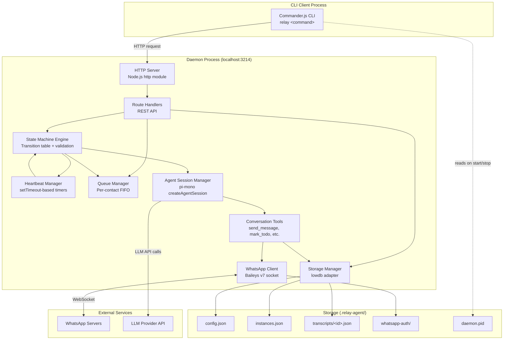

# Relay Agent CLI - Design Document

## Overview

Relay Agent CLI is a local client-daemon system that mediates conversations between a high-privilege AI agent ("Main Agent") and real-world humans via WhatsApp. The CLI provides full lifecycle management of conversation instances, while a persistent background daemon maintains the WhatsApp connection, runs agent sessions, and manages heartbeat timers. This document defines the complete technical design for implementing the Relay Agent CLI from the existing scaffold in `apps/cli/`.

## Design Summary (Meta)

```yaml
design_type: "new_feature"
risk_level: "high"
complexity_level: "high"
complexity_rationale: >
  (1) PRD requires 11-state FSM with validated transitions, per-contact FIFO queue,
  heartbeat timers, pause/resume with state restoration, and concurrent instance management --
  these ACs require managing 5+ distinct states simultaneously and coordinating multiple
  asynchronous processes (WhatsApp WebSocket, heartbeat timers, agent sessions, HTTP server).
  (2) Key risks: Baileys v7 RC instability, WhatsApp account bans, pi-mono session
  reconstruction on restart, race conditions between incoming messages and heartbeat timers.
main_constraints:
  - "Single-machine, single-operator, local-only deployment"
  - "HTTP IPC on localhost:3214 (loopback only)"
  - "One active conversation instance per contact (FIFO queue for extras)"
  - "pi-mono agent sessions must be sandboxed (no filesystem/code execution access)"
  - "ESM-only project (type: module in package.json)"
  - "TypeScript strict mode enabled"
biggest_risks:
  - "WhatsApp account ban due to automated messaging via unofficial API"
  - "Baileys v7 RC breaking changes before stable release"
  - "Race conditions: incoming message vs heartbeat timer on same instance"
  - "pi-mono session reconstruction fidelity after daemon crash"
unknowns:
  - "pi-mono session reconstruction strategy on daemon restart (full transcript replay vs summary)"
  - "Rate limiting strategy for outbound WhatsApp messages"
  - "Agent context injection method (full transcript vs sliding window vs summary)"
```

## Background and Context

### Prerequisite ADRs

- **ADR-001**: WhatsApp Integration via Baileys v7 RC - Defines Baileys as the WhatsApp messaging layer with abstraction requirement
- **ADR-002**: Agent Runtime via pi-mono SDK - Defines pi-mono `createAgentSession` for conversation agent runtime
- **ADR-003**: Local JSON Storage via lowdb - Defines lowdb for all persistent state in `.relay-agent/`
- **ADR-004**: Client-Daemon Architecture with HTTP IPC - Defines background daemon on localhost:3214
- **ADR-005**: Commander.js for CLI Framework - Defines Commander.js for argument parsing
- **ADR-006**: Conversation State Machine Design - Defines 11-state FSM with transition table

### Agreement Checklist

#### Scope
- [x] CLI entry point with 12 subcommands (init, start, stop, status, create, list, get, transcript, cancel, pause, resume, send)
- [x] Background daemon with HTTP server on localhost:3214
- [x] WhatsApp connection via Baileys v7 with QR code authentication
- [x] 11-state conversation state machine with validated transitions
- [x] Heartbeat follow-up system with configurable intervals
- [x] Per-contact FIFO concurrency queue
- [x] pi-mono agent sessions with conversation-scoped tools
- [x] Local JSON persistence via lowdb in `.relay-agent/`
- [x] Stub tools: `place_call()` and `request_human_intervention(reason)`

#### Non-Scope (Explicitly not changing)
- [x] `apps/web/` workspace (fully independent, no shared types)
- [x] Root `package.json` workspace config (only add scripts if needed)
- [x] Voice call implementation (stub only)
- [x] Human intervention alerting (stub only)
- [x] Cloud deployment, multi-device WhatsApp

#### Constraints
- [x] Parallel operation: No (single daemon, single operator)
- [x] Backward compatibility: Not required (greenfield)
- [x] Performance measurement: Required (daemon startup <5s, message latency <3s, CLI response <1s)

#### Applicable Standards
- [x] ESM modules (`"type": "module"` in package.json) `[explicit]` - Source: `apps/cli/package.json`
- [x] TypeScript strict mode `[explicit]` - Source: `apps/cli/tsconfig.json` (`"strict": true`)
- [x] Target ES2022 with NodeNext module resolution `[explicit]` - Source: `apps/cli/tsconfig.json`
- [x] npm workspaces monorepo structure `[explicit]` - Source: root `package.json` (`"workspaces": ["apps/*"]`)
- [x] `.js` extension in imports for ESM compatibility `[implicit]` - Evidence: ESM + NodeNext moduleResolution requires explicit extensions - Confirmed: Yes

### Problem to Solve

The Main Agent (AI) needs a sandboxed, conversation-scoped execution layer to communicate with humans via WhatsApp. There is no existing implementation -- the CLI scaffold in `apps/cli/src/index.ts` contains only a "hello world" placeholder. The entire system must be built from scratch.

### Current Challenges

- No daemon infrastructure exists
- No WhatsApp integration
- No state management or persistence
- No agent session management
- The existing CLI only prints a greeting message

### Requirements

#### Functional Requirements

All functional requirements are sourced from the PRD (docs/plans/prd.md) "Must Have" section:

1. Daemon lifecycle management (start/stop)
2. WhatsApp connection via Baileys v7 (QR auth, reconnection)
3. Conversation instance creation with objective, todos, heartbeat config
4. 11-state conversation state machine with validated transitions
5. Agent tools (send_message, mark_todo_item, end_conversation, schedule_next_heartbeat)
6. Heartbeat follow-up system
7. Instance observability (list, get, transcript, status)
8. Instance control (cancel, pause, resume)
9. Manual message injection (send)
10. Persistent storage via lowdb
11. Per-contact concurrency control (FIFO queue)
12. Stub tools (place_call, request_human_intervention)
13. CLI-to-daemon HTTP IPC

#### Non-Functional Requirements

- **Performance**: Daemon startup <5s, message send latency <3s, CLI command response <1s
- **Reliability**: Survive transient WhatsApp disconnections, zero data loss on graceful shutdown, heartbeat accuracy within 30s
- **Security**: Agent sessions sandboxed (no fs/code access), HTTP bound to 127.0.0.1 only, auth state in `.relay-agent/` with OS-level permissions
- **Scalability**: Up to 10 concurrent conversation instances

## Acceptance Criteria (AC) - EARS Format

### AC-1: Daemon Lifecycle

- [ ] **When** `relay start` is executed and the daemon is not running, the system shall spawn a background Node.js process, write PID to `.relay-agent/daemon.pid`, and bind HTTP server to `127.0.0.1:3214`
- [ ] **When** `relay stop` is executed and the daemon is running, the system shall flush all state to disk and terminate the daemon process
- [ ] **When** `relay start` is executed and the daemon is already running, the system shall display a message indicating the daemon is already running
- [ ] **When** any daemon-dependent CLI command is executed and the daemon is not running, the system shall display a clear error instructing the user to run `relay start`

### AC-2: WhatsApp Connection

- [ ] **When** `relay init` is executed, the system shall display a QR code in the terminal for WhatsApp Web authentication
- [ ] **When** the QR code is scanned successfully, the system shall persist auth state in `.relay-agent/whatsapp-auth/` and reconnect automatically on daemon restart
- [ ] **While** the daemon is running, **if** the WhatsApp connection drops due to a transient network issue, **then** the system shall reconnect automatically with exponential backoff

### AC-3: Instance Creation

- [ ] **When** `relay create` is executed with valid parameters (objective, contact, todos), the system shall create a ConversationInstance in CREATED state and return its unique ID to stdout
- [ ] **When** `relay create` is executed for a contact that already has an active instance, the system shall create the instance in QUEUED state instead of CREATED
- [ ] **When** a prior active instance for a contact reaches a terminal state (COMPLETED, ABANDONED, FAILED), the system shall transition the next QUEUED instance for that contact to CREATED

### AC-4: State Machine Transitions

- [ ] **When** a state-changing event occurs on an instance, the system shall transition only to valid next states as defined by the transition table
- [ ] **If** an invalid state transition is attempted, **then** the system shall reject the transition and log an error with the current state, attempted event, and instance ID
- [ ] **When** `relay pause <id>` is executed on a non-terminal instance, the system shall transition to PAUSED and record the previous state
- [ ] **When** `relay resume <id>` is executed on a PAUSED instance, the system shall transition back to the previously recorded state
- [ ] **When** `relay resume <id>` or `relay send <id> <message>` is executed on an instance in NEEDS_HUMAN_INTERVENTION, the system shall transition to ACTIVE
- [ ] **When** `relay cancel <id>` is executed on a non-terminal instance, the system shall transition to FAILED with reason "cancelled" without sending a farewell message

### AC-5: Agent Tools

- [ ] **When** the agent calls `send_message(text)` within an active conversation, the system shall deliver the message via WhatsApp and record it in the transcript
- [ ] **When** the agent calls `mark_todo_item(todo_id, status)`, the system shall update the todo item status and persist to storage
- [ ] **When** the agent calls `end_conversation(reason)`, the system shall transition the instance to COMPLETED
- [ ] **When** the agent calls `schedule_next_heartbeat(delay)`, the system shall schedule a follow-up timer for the specified delay
- [ ] **When** the agent calls `place_call()`, the system shall log the invocation and return a response indicating the feature is not yet available
- [ ] **When** the agent calls `request_human_intervention(reason)`, the system shall transition the instance to NEEDS_HUMAN_INTERVENTION

### AC-6: Heartbeat System

- [ ] **When** a contact does not respond within the configured heartbeat interval, the system shall invoke the agent to send a follow-up message
- [ ] **When** max follow-ups have been reached and the contact has not responded, the system shall transition the instance to ABANDONED
- [ ] **While** an instance is PAUSED, the system shall suspend heartbeat timers and not send follow-ups

### AC-7: Observability

- [ ] **When** `relay list` is executed, the system shall display all instances with their current state
- [ ] **When** `relay get <id>` is executed, the system shall display the full instance details including objective, todos, state, and heartbeat config
- [ ] **When** `relay transcript <id>` is executed, the system shall display the full message history with timestamps and sender info
- [ ] **When** `relay status` is executed, the system shall display daemon PID, uptime, WhatsApp connection state, and active instance count
- [ ] **When** `relay status --json` is executed, the system shall return the status as a machine-parseable JSON object

### AC-8: Manual Message Injection

- [ ] **When** `relay send <id> <message>` is executed on an active instance, the system shall send the message via WhatsApp and record it in the transcript as a manual injection
- [ ] **When** `relay send <id> <message>` is executed on an instance in NEEDS_HUMAN_INTERVENTION, the system shall send the message, record it, and transition to ACTIVE

### AC-9: Persistence

- [ ] **When** the daemon is restarted gracefully, the system shall restore all instances, transcripts, and configuration from disk with zero data loss
- [ ] **When** the daemon restarts, the system shall reconstruct heartbeat timers for instances in WAITING_FOR_REPLY or HEARTBEAT_SCHEDULED states

## Existing Codebase Analysis

### Implementation Path Mapping

| Type | Path | Description |
|------|------|-------------|
| Existing | `apps/cli/src/index.ts` | CLI entry point -- currently a placeholder printing "Cape Town CLI" |
| Existing | `apps/cli/package.json` | Package config with chalk dependency, `"type": "module"` |
| Existing | `apps/cli/tsconfig.json` | TypeScript config (ES2022, NodeNext, strict) |
| New | `apps/cli/src/commands/*.ts` | 12 CLI command handlers |
| New | `apps/cli/src/daemon/server.ts` | HTTP server (Node.js built-in http module on :3214) |
| New | `apps/cli/src/daemon/routes.ts` | REST API route definitions |
| New | `apps/cli/src/daemon/lifecycle.ts` | Daemon start/stop/PID management |
| New | `apps/cli/src/whatsapp/connection.ts` | Baileys socket, QR code, auth state |
| New | `apps/cli/src/whatsapp/handler.ts` | Incoming message routing to instances |
| New | `apps/cli/src/store/index.ts` | lowdb setup and initialization |
| New | `apps/cli/src/store/config.ts` | Config store (API keys, settings) |
| New | `apps/cli/src/store/instances.ts` | ConversationInstance CRUD |
| New | `apps/cli/src/store/transcripts.ts` | Message transcript storage |
| New | `apps/cli/src/engine/state-machine.ts` | State transitions with validation |
| New | `apps/cli/src/engine/heartbeat.ts` | Heartbeat timer management |
| New | `apps/cli/src/engine/queue.ts` | FIFO concurrency queue per contact |
| New | `apps/cli/src/agent/session.ts` | pi-mono session wrapper |
| New | `apps/cli/src/agent/tools.ts` | Custom conversation-scoped tools |
| New | `apps/cli/src/utils/logger.ts` | Pino logger setup |

### Integration Points

- **Integration Target**: Root workspace (`package.json`)
- **Invocation Method**: `npm run dev:cli` already configured, may need daemon-specific scripts

### Similar Functionality Search

No similar functionality exists in the codebase. The `apps/web/` workspace is a Next.js web application that is explicitly out of scope and shares no types or code with the CLI. The CLI scaffold is a blank placeholder.

**Decision**: Proceed with new implementation.

### Code Inspection Evidence

| File/Function | Relevance |
|---------------|-----------|
| `apps/cli/src/index.ts` | Entry point to replace -- currently placeholder only |
| `apps/cli/package.json` | Package config to extend with new dependencies |
| `apps/cli/tsconfig.json` | TypeScript config -- confirms ES2022/NodeNext/strict |
| `package.json` (root) | Workspace config -- confirms monorepo structure |

## Design

### Change Impact Map

```yaml
Change Target: apps/cli/ (entire CLI application -- greenfield implementation)
Direct Impact:
  - apps/cli/src/index.ts (replace placeholder with Commander.js setup)
  - apps/cli/package.json (add dependencies: commander, baileys, lowdb, pino, pi-mono)
Indirect Impact:
  - .relay-agent/ directory created at runtime (config, instances, transcripts, auth, PID)
  - Port 3214 on localhost occupied when daemon is running
No Ripple Effect:
  - apps/web/ (completely independent workspace)
  - Root package.json (no structural changes needed)
```

### Architecture Overview



### Data Flow

#### CLI Command Flow


#### Instance Creation and First Message Flow


#### Incoming WhatsApp Message Handling


#### Heartbeat Follow-up Cycle


### Integration Point Map

```yaml
Integration Point 1:
  Existing Component: apps/cli/src/index.ts (entry point)
  Integration Method: Replace placeholder with Commander.js program setup
  Impact Level: High (complete replacement)
  Required Test Coverage: CLI command parsing and routing

Integration Point 2:
  Existing Component: apps/cli/package.json (dependencies)
  Integration Method: Add production and dev dependencies
  Impact Level: Medium (dependency additions)
  Required Test Coverage: Build succeeds with new dependencies

Integration Point 3:
  Existing Component: Baileys v7 WebSocket (external)
  Integration Method: Abstraction layer wrapping makeWASocket
  Impact Level: High (external service dependency)
  Required Test Coverage: Connection, reconnection, message send/receive

Integration Point 4:
  Existing Component: pi-mono SDK (external)
  Integration Method: Session factory wrapping createAgentSession
  Impact Level: High (external service dependency)
  Required Test Coverage: Session creation, tool invocation, response handling

Integration Point 5:
  Existing Component: lowdb (external)
  Integration Method: Storage abstraction layer over JSONFilePreset
  Impact Level: Medium (data persistence)
  Required Test Coverage: CRUD operations, persistence across restarts
```

### Main Components

#### Component 1: CLI Entry Point (`src/index.ts`)

- **Responsibility**: Commander.js program setup, command registration, global options (--json)
- **Interface**: `relay <command> [options]` via shell
- **Dependencies**: Commander.js, all command handlers in `src/commands/`

#### Component 2: Command Handlers (`src/commands/*.ts`)

- **Responsibility**: Parse command-specific arguments, make HTTP requests to daemon, format output
- **Interface**: Each exports a function that receives Commander command options and makes HTTP calls
- **Dependencies**: Node.js fetch (built-in), daemon lifecycle utilities

#### Component 3: Daemon Server (`src/daemon/server.ts`, `routes.ts`)

- **Responsibility**: HTTP server on 127.0.0.1:3214, request routing, JSON request/response
- **Interface**: REST API (see API Routes section below)
- **Dependencies**: Node.js `http` module, route handlers

#### Component 4: Daemon Lifecycle (`src/daemon/lifecycle.ts`)

- **Responsibility**: Daemon process spawning, PID file management, graceful shutdown
- **Interface**: `startDaemon()`, `stopDaemon()`, `isDaemonRunning(): boolean`
- **Dependencies**: Node.js `child_process`, `fs`, PID file in `.relay-agent/daemon.pid`

#### Component 5: WhatsApp Client (`src/whatsapp/connection.ts`)

- **Responsibility**: Baileys socket management, QR code display, auth state persistence, reconnection
- **Interface**: `connectWhatsApp()`, `sendMessage(jid, text)`, `onMessage(callback)`, `getConnectionState()`
- **Dependencies**: @whiskeysockets/baileys, `.relay-agent/whatsapp-auth/`

#### Component 6: Message Handler (`src/whatsapp/handler.ts`)

- **Responsibility**: Route incoming WhatsApp messages to the correct ConversationInstance
- **Interface**: Registered as callback on WhatsApp client `messages.upsert` event
- **Dependencies**: WhatsApp client, instance store, state machine

#### Component 7: Storage Layer (`src/store/`)

- **Responsibility**: Persistence of config, instances, and transcripts via lowdb
- **Interface**: `ConfigStore`, `InstanceStore`, `TranscriptStore` with CRUD methods
- **Dependencies**: lowdb, `.relay-agent/` directory

#### Component 8: State Machine Engine (`src/engine/state-machine.ts`)

- **Responsibility**: Validate and execute state transitions, emit events on transition
- **Interface**: `transition(instanceId, event): TransitionResult`, `getValidTransitions(state): Event[]`
- **Dependencies**: Instance store, event emitter

#### Component 9: Heartbeat Manager (`src/engine/heartbeat.ts`)

- **Responsibility**: Schedule, cancel, and fire heartbeat timers per instance
- **Interface**: `scheduleHeartbeat(instanceId, delayMs)`, `cancelHeartbeat(instanceId)`, `reconstructTimers()`
- **Dependencies**: State machine, setTimeout/clearTimeout

#### Component 10: Queue Manager (`src/engine/queue.ts`)

- **Responsibility**: Enforce one-active-instance-per-contact invariant, manage FIFO queue
- **Interface**: `enqueueOrActivate(instance): State`, `onInstanceTerminal(instanceId)`, `getQueueForContact(contact): Instance[]`
- **Dependencies**: Instance store, state machine

#### Component 11: Agent Session (`src/agent/session.ts`)

- **Responsibility**: Create and manage pi-mono agent sessions per instance
- **Interface**: `createSession(instance): AgentSession`, `processMessage(sessionId, message): void`, `destroySession(sessionId): void`
- **Dependencies**: pi-mono SDK, conversation tools

#### Component 12: Conversation Tools (`src/agent/tools.ts`)

- **Responsibility**: Define the tool set available to pi-mono agent sessions
- **Interface**: Tool definitions for `send_message`, `mark_todo_item`, `end_conversation`, `schedule_next_heartbeat`, `place_call` (stub), `request_human_intervention` (stub)
- **Dependencies**: WhatsApp client, instance store, transcript store, state machine, heartbeat manager

### Data Representation Decision

| Criterion | Assessment | Reason |
|-----------|-----------|--------|
| Semantic Fit | N/A | No existing data structures in codebase |
| Responsibility Fit | N/A | Greenfield implementation |
| Lifecycle Fit | N/A | No prior data models |
| Boundary/Interop Cost | Low | All data structures are internal to CLI app |

**Decision**: New structures -- the codebase has no existing data models. All interfaces defined below are new.

### Contract Definitions

```typescript
// ============================================
// Core Data Models
// ============================================

type InstanceState =
  | 'CREATED'
  | 'QUEUED'
  | 'ACTIVE'
  | 'WAITING_FOR_REPLY'
  | 'WAITING_FOR_AGENT'
  | 'HEARTBEAT_SCHEDULED'
  | 'PAUSED'
  | 'NEEDS_HUMAN_INTERVENTION'
  | 'COMPLETED'
  | 'ABANDONED'
  | 'FAILED';

type TerminalState = 'COMPLETED' | 'ABANDONED' | 'FAILED';
type NonTerminalState = Exclude<InstanceState, TerminalState>;

interface TodoItem {
  id: string;
  text: string;
  status: 'pending' | 'in_progress' | 'completed' | 'skipped';
}

interface HeartbeatConfig {
  interval_ms: number;       // Default: 1800000 (30 minutes)
  max_followups: number;     // Default: 5
}

interface ConversationInstance {
  id: string;                           // UUID v4
  objective: string;
  target_contact: string;               // Phone number in international format (e.g., "+56912345678")
  todos: TodoItem[];
  state: InstanceState;
  previous_state: InstanceState | null; // Used for PAUSED resume
  heartbeat_config: HeartbeatConfig;
  follow_up_count: number;
  failure_reason: string | null;        // Set when state is FAILED
  created_at: string;                   // ISO 8601
  updated_at: string;                   // ISO 8601
}

interface TranscriptMessage {
  id: string;
  instance_id: string;
  role: 'agent' | 'contact' | 'system' | 'manual';
  content: string;
  timestamp: string;                    // ISO 8601
}

interface StateTransition {
  instance_id: string;
  from_state: InstanceState;
  to_state: InstanceState;
  trigger: string;                      // Event name that caused the transition
  timestamp: string;                    // ISO 8601
}

interface RelayConfig {
  model_api_key: string | null;
  model_provider: string | null;        // e.g., "anthropic", "openai"
  whatsapp_connected: boolean;
  daemon_port: number;                  // Default: 3214
}

// ============================================
// API Request/Response Contracts
// ============================================

interface CreateInstanceRequest {
  objective: string;
  target_contact: string;
  todos: Array<{ text: string }>;
  heartbeat_config?: Partial<HeartbeatConfig>;
}

interface CreateInstanceResponse {
  id: string;
  state: InstanceState;
}

interface SendMessageRequest {
  message: string;
}

interface DaemonStatusResponse {
  pid: number;
  uptime_seconds: number;
  whatsapp_connected: boolean;
  active_instance_count: number;
  total_instance_count: number;
}

interface ApiErrorResponse {
  error: string;
  details?: string;
}
```

### API Routes (Daemon HTTP Server)

All routes are served on `http://127.0.0.1:3214`.

| Method | Path | Description | Request Body | Response |
|--------|------|-------------|-------------|----------|
| `POST` | `/init` | Configure API keys, trigger QR scan | `{ model_api_key, model_provider }` | `{ whatsapp_qr_displayed: boolean }` |
| `GET` | `/status` | Daemon and WhatsApp status | - | `DaemonStatusResponse` |
| `POST` | `/instances` | Create conversation instance | `CreateInstanceRequest` | `CreateInstanceResponse` |
| `GET` | `/instances` | List all instances | - | `ConversationInstance[]` |
| `GET` | `/instances/:id` | Get instance details | - | `ConversationInstance` |
| `GET` | `/instances/:id/transcript` | Get message transcript | - | `TranscriptMessage[]` |
| `POST` | `/instances/:id/cancel` | Cancel instance | - | `ConversationInstance` |
| `POST` | `/instances/:id/pause` | Pause instance | - | `ConversationInstance` |
| `POST` | `/instances/:id/resume` | Resume instance | - | `ConversationInstance` |
| `POST` | `/instances/:id/send` | Manual message injection | `SendMessageRequest` | `TranscriptMessage` |

Error responses use standard HTTP status codes:
- `400` - Invalid request (missing fields, invalid state transition)
- `404` - Instance not found
- `409` - Conflict (e.g., invalid state for operation)
- `500` - Internal server error

### Data Contract

#### CLI -> Daemon API

```yaml
Input:
  Type: HTTP request (JSON body for POST, URL params for GET)
  Preconditions: Daemon must be running on localhost:3214
  Validation: CLI validates required args before sending; daemon validates request body

Output:
  Type: JSON response with appropriate HTTP status code
  Guarantees: All responses include Content-Type application/json
  On Error: ApiErrorResponse with descriptive error message

Invariants:
  - CLI never writes to storage directly (always via daemon API)
  - All state mutations go through the state machine
```

#### State Machine -> Storage

```yaml
Input:
  Type: State transition event (instanceId, event)
  Preconditions: Instance exists, transition is valid per transition table
  Validation: Transition table lookup before execution

Output:
  Type: Updated ConversationInstance persisted to disk
  Guarantees: State is flushed to lowdb on every transition
  On Error: Transition rejected, original state preserved, error logged

Invariants:
  - No instance can be in two states simultaneously
  - Terminal states (COMPLETED, ABANDONED, FAILED) are absorbing (no outgoing transitions)
  - PAUSED always stores previous_state for resume
```

### State Transitions and Invariants

#### Full State Transition Table

| Current State | Event | Next State | Side Effects |
|---------------|-------|------------|-------------|
| CREATED | `agent_sends_first_message` | ACTIVE | Create pi-mono session, send message via WhatsApp |
| CREATED | `contact_has_active_instance` | QUEUED | Add to per-contact FIFO queue |
| CREATED | `pause` | PAUSED | Store previous_state = CREATED |
| CREATED | `cancel` | FAILED | Set failure_reason = "cancelled" |
| QUEUED | `prior_instance_terminal` | CREATED | Dequeue, begin normal processing |
| QUEUED | `pause` | PAUSED | Store previous_state = QUEUED |
| QUEUED | `cancel` | FAILED | Set failure_reason = "cancelled", remove from queue |
| ACTIVE | `message_sent` | WAITING_FOR_REPLY | Schedule heartbeat timer |
| ACTIVE | `end_conversation` | COMPLETED | Clean up session, check queue |
| ACTIVE | `request_intervention` | NEEDS_HUMAN_INTERVENTION | Pause agent processing |
| ACTIVE | `unrecoverable_error` | FAILED | Log error, clean up |
| ACTIVE | `pause` | PAUSED | Store previous_state = ACTIVE, suspend timers |
| ACTIVE | `cancel` | FAILED | Set failure_reason = "cancelled" |
| WAITING_FOR_REPLY | `contact_replies` | WAITING_FOR_AGENT | Cancel heartbeat timer |
| WAITING_FOR_REPLY | `heartbeat_fires` | HEARTBEAT_SCHEDULED | - |
| WAITING_FOR_REPLY | `end_conversation` | COMPLETED | Clean up session, check queue |
| WAITING_FOR_REPLY | `pause` | PAUSED | Store previous_state = WAITING_FOR_REPLY, cancel timer |
| WAITING_FOR_REPLY | `cancel` | FAILED | Set failure_reason = "cancelled", cancel timer |
| WAITING_FOR_AGENT | `agent_processes_reply` | ACTIVE | Agent decides next action |
| WAITING_FOR_AGENT | `end_conversation` | COMPLETED | Clean up session, check queue |
| WAITING_FOR_AGENT | `pause` | PAUSED | Store previous_state = WAITING_FOR_AGENT |
| WAITING_FOR_AGENT | `cancel` | FAILED | Set failure_reason = "cancelled" |
| HEARTBEAT_SCHEDULED | `followup_sent` | WAITING_FOR_REPLY | Increment follow_up_count, schedule next timer |
| HEARTBEAT_SCHEDULED | `max_followups_exceeded` | ABANDONED | Clean up session, check queue |
| HEARTBEAT_SCHEDULED | `pause` | PAUSED | Store previous_state = HEARTBEAT_SCHEDULED, cancel timer |
| HEARTBEAT_SCHEDULED | `cancel` | FAILED | Set failure_reason = "cancelled", cancel timer |
| PAUSED | `resume` | (previous_state) | Restore previous_state, reconstruct timers if needed |
| PAUSED | `cancel` | FAILED | Set failure_reason = "cancelled" |
| NEEDS_HUMAN_INTERVENTION | `resume` | ACTIVE | Resume agent processing |
| NEEDS_HUMAN_INTERVENTION | `manual_send` | ACTIVE | Send message, resume agent |
| NEEDS_HUMAN_INTERVENTION | `pause` | PAUSED | Store previous_state = NEEDS_HUMAN_INTERVENTION |
| NEEDS_HUMAN_INTERVENTION | `cancel` | FAILED | Set failure_reason = "cancelled" |

#### System Invariants

```yaml
System Invariants:
  - At most one instance per contact in a non-terminal, non-QUEUED state
  - Terminal states have no outgoing transitions
  - Every PAUSED instance has a non-null previous_state
  - follow_up_count never exceeds max_followups + 1
  - Every state transition is persisted to disk before side effects execute
  - Transcript messages are append-only (never deleted or modified)
```

### Integration Boundary Contracts

```yaml
Boundary: CLI -> Daemon HTTP
  Input: HTTP request with JSON body (for mutations) or URL params (for queries)
  Output: Synchronous JSON response with HTTP status code
  On Error: HTTP 4xx/5xx with ApiErrorResponse body; CLI displays error.message to stderr

Boundary: Daemon -> WhatsApp (Baileys)
  Input: Message text + recipient JID
  Output: Async - message delivery confirmation or error
  On Error: Retry with exponential backoff (3 attempts); on final failure, transition instance to FAILED

Boundary: Daemon -> pi-mono Agent
  Input: Conversation context (objective, todos, transcript) + tool definitions
  Output: Async - agent actions (tool calls) executed sequentially
  On Error: Log error; if recoverable (network timeout), retry once; if unrecoverable, transition to NEEDS_HUMAN_INTERVENTION

Boundary: Daemon -> Storage (lowdb)
  Input: Data objects conforming to TypeScript interfaces
  Output: Promise<void> (lowdb.write() is async; must await before executing side effects)
  On Error: Log error with full context; if write fails, daemon continues with in-memory state and retries on next transition

Boundary: Heartbeat Timer -> State Machine
  Input: Timer fire event with instanceId
  Output: Synchronous state transition
  On Error: If instance no longer in expected state, log warning and discard timer event
```

### Field Propagation Map

| Field | Boundary | Status | Detail |
|-------|----------|--------|--------|
| `instance.id` | CLI -> API -> Store | preserved | UUID generated on creation, used as key everywhere |
| `instance.state` | Store -> API -> CLI | preserved | Enum string, displayed as-is |
| `instance.target_contact` | CLI -> API -> WhatsApp | transformed | CLI receives phone string, WhatsApp needs JID format (`number@s.whatsapp.net`) |
| `instance.todos` | CLI -> API -> Agent | preserved | Array of TodoItem, agent reads and updates via tools |
| `transcript.content` | Agent/Contact -> Store -> CLI | preserved | Raw message text, stored and displayed as-is |
| `heartbeat_config` | CLI (optional) -> API -> HeartbeatManager | transformed | Partial input merged with defaults; manager uses interval_ms for setTimeout |

### Error Handling

#### Error Categories and Responses

| Error Category | Detection | Response | Recovery |
|---------------|-----------|----------|----------|
| Daemon not running | CLI: HTTP connection refused | Display "Daemon not running. Run `relay start` first." to stderr | User runs `relay start` |
| Invalid state transition | State machine: transition table lookup fails | Return HTTP 409 with current state and attempted event | User/agent retries with valid action |
| Instance not found | Store: lookup returns null | Return HTTP 404 | User checks instance ID |
| WhatsApp disconnected | Baileys: connection.update event | Auto-reconnect with exponential backoff (1s, 2s, 4s, 8s, 16s, max 30s) | Auto-recovery; instances in WAITING_FOR_REPLY continue waiting |
| WhatsApp reconnect fails (5+ attempts) | Reconnection counter | Log critical error, set whatsapp_connected = false | User checks network, runs `relay init` to re-authenticate |
| Agent session error | pi-mono throws/rejects | Transition to NEEDS_HUMAN_INTERVENTION, log error with context | User runs `relay resume` or `relay send` |
| Storage write failure | lowdb.write() throws | Log error, continue with in-memory state, retry on next write | Self-healing on next successful write |
| Stale PID file | `relay start` finds PID file but process not running | Remove stale PID file and start fresh | Automatic |
| Port 3214 in use | HTTP server bind fails | Display error with port conflict message | User stops conflicting process |

### Logging and Monitoring

Use **Pino** logger with structured JSON output.

```typescript
// Logger configuration
import pino from 'pino';

const logger = pino({
  name: 'relay-agent',
  level: process.env.RELAY_LOG_LEVEL || 'info',
  transport: {
    target: 'pino-pretty',
    options: { colorize: true }
  }
});
```

Log levels:
- `error`: Unrecoverable errors, failed state transitions, WhatsApp disconnection failures
- `warn`: Invalid transition attempts, heartbeat timer discards, stale PID cleanup
- `info`: State transitions, instance creation/completion, daemon start/stop
- `debug`: Incoming/outgoing messages, agent tool calls, timer scheduling

Log file: `.relay-agent/relay.log` (in addition to stdout in dev)

## Implementation Plan

### Implementation Approach

**Selected Approach**: Vertical Slice (Feature-driven) with foundational dependencies first

**Selection Reason**: The system has clear vertical features (daemon lifecycle, WhatsApp connection, instance management, heartbeat) that each deliver testable value. However, storage and state machine are foundational dependencies that multiple features require, so these are built first as a horizontal foundation before vertical feature slices.

### Technical Dependencies and Implementation Order

#### Phase 1: Foundation (Storage + State Machine + Daemon Shell)

1. **Storage Layer** (`src/store/`)
   - Technical Reason: All other components depend on persistence
   - Dependent Elements: State machine, instance management, transcripts, config

2. **State Machine Engine** (`src/engine/state-machine.ts`)
   - Technical Reason: Core domain logic; all features trigger state transitions
   - Prerequisites: Storage layer for persisting transitions

3. **Daemon Lifecycle** (`src/daemon/lifecycle.ts`, `server.ts`, `routes.ts`)
   - Technical Reason: HTTP server is the communication backbone
   - Prerequisites: Storage (reads config on startup)

4. **CLI Entry Point** (`src/index.ts`, `src/commands/`)
   - Technical Reason: User-facing interface for all daemon interactions
   - Prerequisites: Daemon running to receive HTTP requests

#### Phase 2: WhatsApp Integration

5. **WhatsApp Connection** (`src/whatsapp/connection.ts`)
   - Technical Reason: Messaging layer required before agent can operate
   - Prerequisites: Daemon (hosts the connection), Storage (auth state persistence)

6. **Message Handler** (`src/whatsapp/handler.ts`)
   - Technical Reason: Routes incoming messages to instances
   - Prerequisites: WhatsApp connection, state machine, instance store

#### Phase 3: Agent and Conversation Engine

7. **Agent Session Manager** (`src/agent/session.ts`, `tools.ts`)
   - Technical Reason: Agent needs WhatsApp client (for send_message) and state machine (for end_conversation)
   - Prerequisites: WhatsApp client, state machine, storage

8. **Queue Manager** (`src/engine/queue.ts`)
   - Technical Reason: Enforces per-contact concurrency
   - Prerequisites: State machine, instance store

9. **Heartbeat Manager** (`src/engine/heartbeat.ts`)
   - Technical Reason: Requires agent session (to generate follow-ups) and state machine
   - Prerequisites: Agent session, state machine

#### Phase 4: Quality Assurance

10. **Integration Testing**: E2E flows (create -> message -> heartbeat -> complete)
11. **Error Scenario Testing**: All error categories from Error Handling section
12. **Daemon Restart Recovery**: Verify state reconstruction from disk

### Integration Points (E2E Verification)

**Integration Point 1: CLI -> Daemon**
- Components: Commander.js CLI -> HTTP Server
- Verification: `relay status` returns valid JSON when daemon is running; returns error when not

**Integration Point 2: Daemon -> WhatsApp**
- Components: HTTP Server -> Baileys WebSocket -> WhatsApp
- Verification: `relay init` displays QR code; after scan, `relay status` shows `whatsapp_connected: true`

**Integration Point 3: Instance Lifecycle**
- Components: CLI -> API -> State Machine -> Storage
- Verification: `relay create` -> `relay get <id>` shows correct state; `relay pause <id>` -> `relay get <id>` shows PAUSED

**Integration Point 4: Agent -> WhatsApp**
- Components: pi-mono Session -> Conversation Tools -> Baileys -> WhatsApp
- Verification: Created instance sends first message to contact via WhatsApp

**Integration Point 5: Incoming Message -> Agent**
- Components: WhatsApp -> Message Handler -> State Machine -> Agent
- Verification: Contact reply triggers agent processing and response

**Integration Point 6: Heartbeat -> Follow-up**
- Components: Heartbeat Manager -> State Machine -> Agent -> WhatsApp
- Verification: After configured interval with no reply, follow-up message is sent

## Test Strategy

### Basic Test Design Policy

Each acceptance criterion maps to at least one test case. Tests are organized by the testing pyramid: many unit tests, fewer integration tests, minimal E2E tests.

### Unit Tests

- **State Machine**: Test every valid transition, every invalid transition rejection, PAUSED resume logic, terminal state absorption
- **Queue Manager**: FIFO ordering, single-active-per-contact invariant, dequeue on terminal
- **Heartbeat Manager**: Timer scheduling, cancellation, max followup detection, timer reconstruction
- **Storage Layer**: CRUD operations for instances, transcripts, config
- **Command Handlers**: Argument parsing, HTTP request construction, output formatting
- **Tools**: Each tool function produces correct side effects

Coverage goal: 80%+ on `src/engine/`, `src/store/`, `src/agent/tools.ts`

### Integration Tests

- CLI -> Daemon round-trip for each command
- State machine + storage (transitions persist correctly)
- Heartbeat manager + state machine (timer fires trigger transitions)
- Queue manager + state machine (terminal state dequeues next instance)

### E2E Tests

- Full instance lifecycle: create -> first message -> reply -> completion
- Heartbeat cycle: create -> no reply -> follow-ups -> abandonment
- Pause/Resume: create -> pause -> resume -> continue
- Queue: create two instances for same contact -> first completes -> second activates
- Daemon restart recovery: create instance -> stop daemon -> start daemon -> verify state

### Performance Tests

- Daemon startup time: measure cold start to HTTP server ready (<5s)
- CLI command latency: measure `relay list` round-trip (<1s)
- Concurrent instances: create 10 instances, verify no degradation

## Security Considerations

1. **HTTP server bound to 127.0.0.1 only**: No external network access to daemon API
2. **Agent sandboxing**: pi-mono sessions receive only conversation-scoped tools; no read/write/edit/bash tools
3. **Auth state protection**: `.relay-agent/whatsapp-auth/` should have 700 permissions (owner only)
4. **No secrets in logs**: API keys masked in log output; message content logged at debug level only
5. **Input validation**: All CLI arguments and API request bodies validated before processing

## Future Extensibility

1. **Storage backend swap**: Storage abstraction interface allows replacing lowdb with SQLite or PostgreSQL
2. **WhatsApp backend swap**: Baileys wrapped behind interface; can swap to official API if approved
3. **Agent runtime swap**: Session factory pattern allows replacing pi-mono with other agent frameworks
4. **Configurable port**: `daemon_port` in RelayConfig supports changing from default 3214
5. **Conversation templates**: CreateInstanceRequest structure already accepts arbitrary objective and todos
6. **Event webhooks**: State machine event emitter can be extended to fire HTTP webhooks

## Alternative Solutions

### Alternative 1: Single-Process Architecture (No Daemon)

- **Overview**: Run everything in a single CLI process per command invocation
- **Advantages**: Simpler architecture, no IPC, no PID management
- **Disadvantages**: Cannot maintain persistent WhatsApp connection, no background heartbeat timers, connection re-establishment on every command (>5s per invocation)
- **Reason for Rejection**: Fundamentally incompatible with real-time WhatsApp messaging and heartbeat requirements

### Alternative 2: SQLite Instead of lowdb

- **Overview**: Use better-sqlite3 for persistence
- **Advantages**: ACID transactions, concurrent read support, query performance
- **Disadvantages**: Native compilation dependency (node-gyp), overkill for <100 records, not human-readable
- **Reason for Rejection**: lowdb's simplicity and human-readable JSON files are more appropriate for a local CLI tool at v1 scale (see ADR-003)

## Risks and Mitigation

| Risk | Impact | Probability | Mitigation |
|------|--------|-------------|------------|
| WhatsApp account ban | High | High | Users accept ToS risk; rate limiting; human-like message patterns |
| Baileys v7 RC breaking changes | Medium | Medium | Pin exact version; abstraction layer isolates system |
| Race condition: message + heartbeat | Medium | Medium | Serialize events per instance via queue; state machine validates transitions |
| pi-mono session reconstruction failure | Medium | Low | Persist full transcript; reconstruct from objective + todos + history |
| Daemon crash mid-write | Low | Low | lowdb flushes on each transition; at worst lose last in-flight transition |
| Port 3214 conflict | Low | Low | Clear error message; configurable port in config |

## References

- [Baileys GitHub Repository](https://github.com/WhiskeySockets/Baileys) - WhatsApp Web API, socket setup, auth state management
- [Baileys Documentation](https://baileys.wiki/docs/intro/) - Official Baileys wiki with usage guides
- [Baileys npm Package](https://www.npmjs.com/package/@whiskeysockets/baileys) - v7.0.0-rc.9 package details
- [lowdb GitHub Repository](https://github.com/typicode/lowdb) - JSON file database, ESM setup
- [lowdb npm Package](https://www.npmjs.com/package/lowdb) - API reference and TypeScript usage
- [Commander.js GitHub](https://github.com/tj/commander.js) - CLI framework documentation
- [pi-mono GitHub Repository](https://github.com/badlogic/pi-mono) - Agent SDK with createAgentSession
- [pi-mono SDK Documentation](https://github.com/badlogic/pi-mono/blob/main/packages/coding-agent/docs/sdk.md) - Programmatic session creation
- [Pino Logger](https://github.com/pinojs/pino) - Fast structured JSON logger for Node.js

## Update History

| Date | Version | Changes | Author |
|------|---------|---------|--------|
| 2026-02-20 | 1.0 | Initial design document | AI Assistant |
