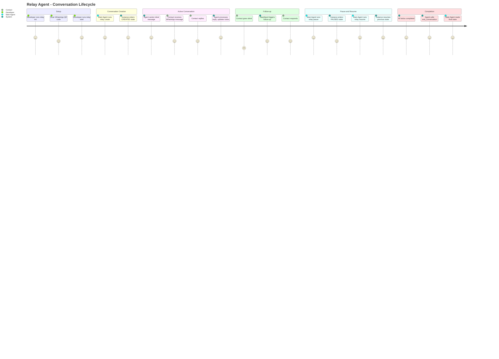
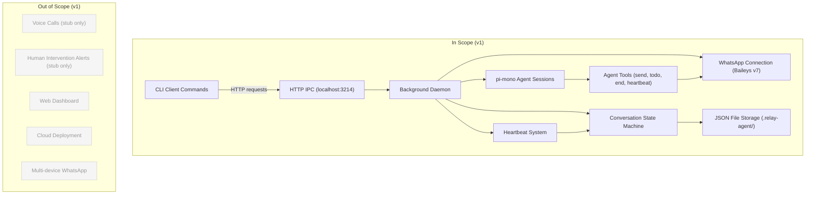
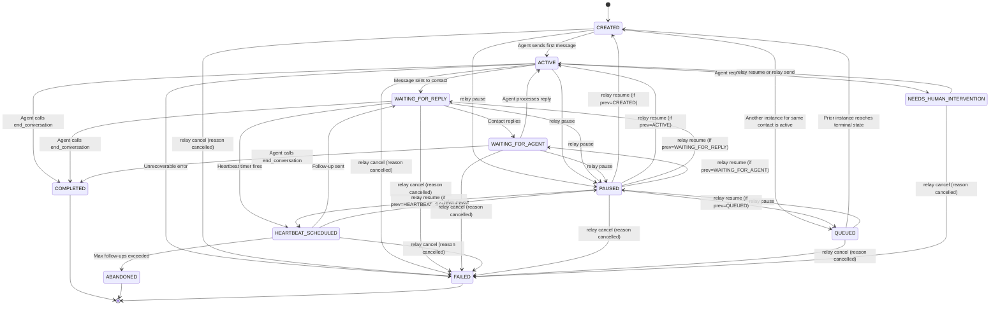

# PRD: Relay Agent CLI

## Overview

### One-line Summary
Relay is a local CLI agent that acts as a privilege-isolated conversational execution layer, mediating all communication between a high-privilege internal agent ("Main Agent") and real-world humans via WhatsApp.

### Background
AI agent systems increasingly need to interact with humans through real-world messaging channels. However, granting an AI agent direct access to messaging APIs introduces security risks and complexity. Relay solves this by providing a sandboxed, conversation-scoped execution environment where an external agent can only perform a limited set of actions (send messages, track todos, manage heartbeats) without any access to the host system's filesystem, network, or code execution capabilities.

The system is architected as a client-daemon pair: a persistent background daemon manages the WhatsApp connection and conversation state, while lightweight CLI commands provide full observability and control. This design enables the Main Agent to orchestrate human conversations programmatically through simple shell commands, while maintaining strict privilege isolation.

## User Stories

### Primary Users

1. **Main Agent (AI)** - A high-privilege AI agent running locally that needs to communicate with humans via WhatsApp. The Main Agent consumes the CLI as its primary API surface.
2. **Developer/Operator** - A human developer who sets up, monitors, and debugs the Relay system. Uses CLI commands for configuration, status checks, and transcript review.

### User Stories

```
As a Main Agent
I want to create a conversation instance with a specific objective and todo list
So that I can delegate human communication to the isolated Relay agent
```

```
As a Main Agent
I want to monitor conversation progress via CLI commands
So that I can track todo completion and decide next actions
```

```
As a Main Agent
I want the system to automatically follow up with unresponsive humans
So that conversations progress without requiring my constant attention
```

```
As a Developer
I want to initialize and configure Relay with a single command
So that I can quickly set up the WhatsApp connection and API keys
```

```
As a Developer
I want to view conversation transcripts and instance state
So that I can debug and verify agent behavior
```

```
As a Developer
I want to manually inject messages into active conversations
So that I can intervene when the agent needs human guidance
```

## Functional Requirements

### Must Have (MVP)

- [ ] **Daemon lifecycle management**: `relay start` launches a persistent background Node.js process; `relay stop` terminates it gracefully
  - AC: Given the daemon is not running, when `relay start` is executed, then a background process starts and persists until explicitly stopped or the system shuts down
  - AC: Given the daemon is running, when `relay stop` is executed, then the process terminates and all state is flushed to disk

- [ ] **WhatsApp connection via Baileys v7**: The daemon establishes and maintains a WhatsApp Web connection using QR code authentication
  - AC: Given Relay is initialized, when `relay init` is run, then a QR code is displayed in the terminal for scanning
  - AC: Given the QR code is scanned, then the auth state persists in `.relay-agent/` and reconnects automatically on daemon restart

- [ ] **Conversation instance creation**: `relay create` accepts an objective, contact number, todo list, and optional heartbeat config to create a new ConversationInstance
  - AC: Given valid parameters, when `relay create` is executed, then an instance is created in CREATED state with a unique ID returned to stdout

- [ ] **Conversation state machine**: Each instance follows the defined state transitions (CREATED, ACTIVE, WAITING_FOR_REPLY, WAITING_FOR_AGENT, HEARTBEAT_SCHEDULED, PAUSED, QUEUED, COMPLETED, NEEDS_HUMAN_INTERVENTION, ABANDONED, FAILED)
  - AC: Given an instance in any state, when a state-changing event occurs, then the instance transitions only to valid next states as defined by the state machine
  - AC: Given an instance in any non-terminal state (CREATED, ACTIVE, WAITING_FOR_REPLY, WAITING_FOR_AGENT, HEARTBEAT_SCHEDULED, PAUSED, QUEUED), when `relay pause <id>` is executed, then the instance transitions to PAUSED and the previous state is recorded for resumption
  - AC: Given an instance in PAUSED state, when `relay resume <id>` is executed, then the instance transitions back to the state it was in before being paused
  - AC: Given an active instance exists for contact X, when `relay create` is called for the same contact X, then the new instance enters QUEUED state instead of CREATED
  - AC: Given a QUEUED instance for contact X, when the prior active instance for contact X reaches a terminal state (COMPLETED, ABANDONED, FAILED), then the queued instance transitions to CREATED and begins normal processing
  - AC: Given an instance in any non-terminal state, when `relay cancel <id>` is executed, then the instance transitions to FAILED with reason "cancelled"
  - AC: Given an instance in NEEDS_HUMAN_INTERVENTION state, when `relay resume <id>` or `relay send <id> <message>` is executed, then the instance transitions to ACTIVE

- [ ] **Agent tools (conversation-scoped)**: The pi-mono agent session within each instance has access to: `send_message(text)`, `mark_todo_item(todo_id, status)`, `end_conversation(reason)`, `schedule_next_heartbeat(delay)`
  - AC: Given an active conversation, when the agent calls `send_message(text)`, then the message is delivered via WhatsApp and recorded in the transcript

- [ ] **Heartbeat system**: Configurable follow-up timer that automatically re-engages unresponsive contacts
  - AC: Given a heartbeat interval of 30 minutes and max follow-ups of 5, when the contact does not respond within 30 minutes, then the agent sends a follow-up message
  - AC: Given max follow-ups have been reached, when the contact still does not respond, then the instance transitions to ABANDONED

- [ ] **Instance observability**: `relay list`, `relay get <id>`, `relay transcript <id>`, and `relay status` provide full visibility into system and conversation state
  - AC: Given active instances exist, when `relay list` is executed, then all instances are displayed with their current state
  - AC: Given an instance ID, when `relay transcript <id>` is executed, then the full message history is displayed with timestamps and sender info

- [ ] **Instance control**: `relay cancel <id>`, `relay pause <id>`, `relay resume <id>` allow lifecycle management of instances
  - AC: Given an active instance, when `relay pause <id>` is executed, then heartbeats are suspended and the agent stops processing incoming messages
  - AC: Given a paused instance, when `relay resume <id>` is executed, then normal operation resumes from the state prior to pausing
  - AC: Given an instance in NEEDS_HUMAN_INTERVENTION state, when `relay resume <id>` is executed, then the instance transitions to ACTIVE and the agent resumes processing
  - AC: Given an instance in any non-terminal state, when `relay cancel <id>` is executed, then the instance transitions to FAILED with reason "cancelled" and no farewell message is sent to the contact

- [ ] **Manual message injection**: `relay send <id> <message>` allows sending a message as the agent into an active conversation
  - AC: Given an active instance, when `relay send <id> "hello"` is executed, then "hello" is sent to the contact via WhatsApp and recorded in the transcript
  - AC: Given an instance in NEEDS_HUMAN_INTERVENTION state, when `relay send <id> <message>` is executed, then the message is sent to the contact, recorded in the transcript, and the instance transitions to ACTIVE

- [ ] **Persistent storage**: All state (config, instances, transcripts, WhatsApp auth) persists in `.relay-agent/` as JSON files using lowdb
  - AC: Given the daemon is restarted, then all instances, transcripts, and configuration are restored from disk

- [ ] **Concurrency control**: Only 1 active instance per contact; additional instances for the same contact are queued (FIFO)
  - AC: Given an active instance for contact X, when a new instance for contact X is created, then it enters QUEUED state and activates only after the prior instance reaches a terminal state

- [ ] **Stub tools**: `place_call()` and `request_human_intervention(reason)` are implemented as stubs that log the invocation but take no real action
  - AC: Given the agent calls `place_call()`, then a log entry is created and the agent receives a response indicating the feature is not yet available

- [ ] **CLI-to-daemon IPC via HTTP**: The daemon runs an HTTP server on `localhost:3214`. All CLI commands communicate with the daemon by making HTTP requests to this local server.
  - AC: Given the daemon is running, when any CLI command is executed (e.g., `relay list`, `relay create`, `relay send`), then the CLI makes an HTTP request to `http://localhost:3214` and returns the response to stdout
  - AC: Given the daemon is not running, when any CLI command that requires the daemon is executed, then the CLI detects the unreachable server and displays a clear error message instructing the user to run `relay start`

### Should Have

- [ ] **Structured daemon status output**: `relay status` returns machine-parseable output (JSON) for Main Agent consumption
  - AC: Given the daemon is running, when `relay status --json` is executed, then a JSON object with daemon PID, uptime, WhatsApp connection state, and active instance count is returned

- [ ] **Graceful error recovery**: The daemon recovers from transient WhatsApp disconnections without losing state
  - AC: Given a temporary network interruption, when connectivity is restored, then the daemon reconnects and resumes all active conversations

### Could Have

- [ ] **Conversation templates**: Pre-defined conversation objectives and todo lists that can be referenced by name in `relay create`
- [ ] **Event webhooks**: Emit HTTP callbacks on state transitions for external monitoring

### Out of Scope

- **Voice calls**: `place_call()` is a stub in v1; full VoIP integration is deferred
- **Human intervention notification**: `request_human_intervention()` logs only; no alerting system (Slack, email, etc.)
- **Web dashboard**: Separate branch; not part of the CLI product
- **Cloud deployment**: Relay is designed as a local-only tool in v1
- **Multi-device WhatsApp support**: Single device pairing only
- **Shared types with apps/web**: Relay CLI is fully independent from the web workspace

## Non-Functional Requirements

### Performance
- Daemon startup time: under 5 seconds
- Message send latency (CLI to WhatsApp delivery): under 3 seconds
- CLI command response time (non-daemon commands): under 1 second
- Support up to 10 concurrent conversation instances without degradation

### Reliability
- Daemon uptime: survives transient WhatsApp disconnections with automatic reconnection
- State persistence: zero data loss on graceful shutdown; best-effort on crash (last-write wins via lowdb flush)
- Heartbeat timer accuracy: within 30 seconds of scheduled time

### Security
- The pi-mono agent session has NO access to: filesystem, code execution, web browsing, or any system resource outside its conversation scope
- All external input (WhatsApp messages from contacts) is isolated and never exposed to the Main Agent's execution context
- WhatsApp auth credentials stored locally in `.relay-agent/` with filesystem-level permissions only
- No network listeners beyond the WhatsApp WebSocket connection and the local HTTP IPC server on `localhost:3214` (bound to loopback interface only)

### Scalability
- v1 is designed for single-machine, single-operator use
- Storage scales linearly with conversation count (JSON files)
- Future versions may introduce database-backed storage for higher throughput

## Success Criteria

### Quantitative Metrics
1. The agent can initiate and complete a full conversation lifecycle (CREATED through COMPLETED) via WhatsApp with zero manual intervention
2. The heartbeat system correctly sends up to 5 follow-up messages at the configured interval and transitions to ABANDONED when exceeded
3. All instance state persists correctly across daemon restart (100% state recovery for graceful shutdown)
4. CLI commands return accurate state information for all instances within 1 second

### Qualitative Metrics
1. A developer can go from zero to first conversation in under 10 minutes (init, start, create, observe)
2. The Main Agent can operate Relay entirely through CLI commands without any out-of-band communication

## Technical Considerations

### Dependencies
- **Baileys v7 RC** ([WhiskeySockets/Baileys](https://github.com/WhiskeySockets/Baileys)) - WhatsApp Web API via WebSockets, QR code authentication
- **pi-mono** - Conversation agent runtime (one session per instance)
- **lowdb** - JSON file-based storage for `.relay-agent/` state
- **Node.js** - Runtime for both daemon and CLI

### Constraints
- WhatsApp Web protocol is unofficial; Baileys depends on reverse-engineered APIs that may change
- Single WhatsApp account per Relay installation (one phone number)
- Daemon must run on the same machine as the Main Agent (local IPC via HTTP on localhost:3214)
- No interactive terminal UI in the daemon (headless operation)

### Assumptions
- The operator has a WhatsApp account available for Relay to use
- The Main Agent can execute shell commands and parse stdout/stderr
- Network connectivity is generally stable (transient failures are tolerable; extended outages are not)
- pi-mono agent sessions are stateless enough to be reconstructed from persisted conversation history on restart

### Risks and Mitigation

| Risk | Impact | Probability | Mitigation |
|------|--------|-------------|------------|
| WhatsApp blocks the account due to automated messaging | High | High | Users accept full responsibility for WhatsApp ToS compliance. This tool is intended for structured, objective-driven interactions only. The developers acknowledge the risk and proceed with informed consent. Rate limiting, human-like message patterns, and guidance in docs remain in place as technical safeguards. |
| Baileys v7 RC introduces breaking changes before stable release | Medium | Medium | Pin exact version, monitor upstream releases |
| pi-mono agent produces harmful or off-topic messages | High | Low | Conversation-scoped tools only, objective constraints, transcript logging for audit |
| Daemon crashes mid-conversation | Medium | Low | Persistent state via lowdb; restart recovers last-flushed state |
| Contact reports the number as spam | Medium | Medium | Configurable message frequency, respectful heartbeat defaults |

## User Journey Diagram



## Scope Boundary Diagram



## Conversation State Machine Diagram



## Undetermined Items

- [ ] **pi-mono session reconstruction on daemon restart**: What is the exact behavior when the daemon restarts and pi-mono sessions must be reconstructed? Does the agent receive the full prior transcript, a summary, or start fresh with only the objective and todo state?
- [ ] **Rate limiting strategy for WhatsApp messages**: What specific rate limits should be enforced on outbound messages (per contact, per time window)? Should this be a configurable parameter or a hardcoded safety default?
- [ ] **Agent context injection method**: When the pi-mono agent is invoked for a conversation turn, does it receive the full transcript history, a summarized context window, or only the latest message plus objective/todo state? This affects both token usage and agent decision quality.

## Appendix

### References
- [Baileys WhatsApp Web API](https://github.com/WhiskeySockets/Baileys)
- [Baileys Documentation](https://baileys.wiki/docs/intro/)

### Glossary
- **Main Agent**: The high-privilege AI agent that orchestrates Relay via CLI commands. It has full system access but delegates human communication to Relay.
- **pi-mono**: The conversation agent runtime that powers each ConversationInstance. Each instance gets its own isolated session.
- **ConversationInstance**: A single conversation between the agent and one human contact, with its own objective, todo list, state, and heartbeat policy.
- **Heartbeat**: An automatic follow-up mechanism that re-engages contacts who have not responded within a configurable time interval.
- **Daemon**: The persistent background Node.js process that maintains the WhatsApp connection and runs all active conversation sessions.
- **Privilege Isolation**: The security model ensuring the external-facing agent cannot access the host system's resources.
- **lowdb**: A lightweight JSON file database used for persisting all Relay state locally.
- **PAUSED**: A state indicating the instance has been temporarily suspended by operator command. The previous state is recorded so the instance can resume exactly where it left off.
- **QUEUED**: A state for instances targeting a contact that already has an active instance. The queued instance waits (FIFO) until the prior instance completes.

---

*Document version: 1.1*
*Created: 2026-02-20*
*Last updated: 2026-02-20*
*Status: Draft*

### Change History

| Version | Date | Changes |
|---------|------|---------|
| 1.0 | 2026-02-20 | Initial PRD creation |
| 1.1 | 2026-02-20 | Added PAUSED and QUEUED states to state machine with full transition definitions. Made NEEDS_HUMAN_INTERVENTION a non-terminal state with recovery via relay resume or relay send. Specified HTTP on localhost:3214 as CLI-to-daemon IPC mechanism. Upgraded WhatsApp ToS risk to High probability with informed consent disclaimer. Defined relay cancel acceptance criteria (transitions to FAILED with reason "cancelled", no farewell message). Added Undetermined Items section for pi-mono session reconstruction, rate limiting strategy, and agent context injection method. |
