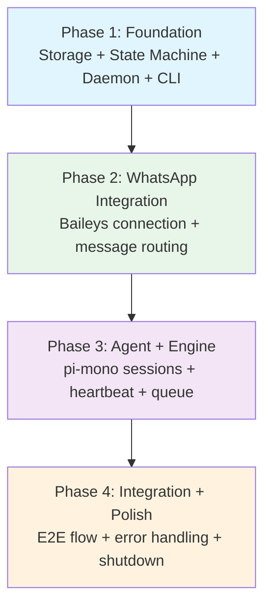

# Work Plan: Relay Agent CLI Implementation

Created Date: 2026-02-20
Type: feature
Estimated Duration: 8-10 days
Estimated Impact: 20+ new files in `apps/cli/`
Related Issue/PR: N/A (greenfield implementation)

## Related Documents
- Design Doc: [docs/plans/design-doc.md](./design-doc.md)
- ADR: [docs/plans/adr.md](./adr.md)
- PRD: [docs/plans/prd.md](./prd.md)

## Objective

Build the complete Relay Agent CLI system from the existing scaffold in `apps/cli/`. This is a client-daemon system that mediates conversations between a high-privilege AI agent ("Main Agent") and real-world humans via WhatsApp. The system includes a background daemon with HTTP API, WhatsApp integration via Baileys v7, an 11-state conversation FSM, pi-mono agent sessions, heartbeat follow-up timers, and a full CLI interface.

## Background

The current `apps/cli/` contains only a placeholder "hello world" CLI with chalk as its sole dependency. The package is named `@cape-town/cli` with a `cape-town` binary. Everything must be built from scratch: daemon infrastructure, WhatsApp integration, state management, persistence, agent sessions, and all 12 CLI subcommands.

## Phase Structure Diagram

## Task Dependency Diagram

```mermaid
graph LR
    subgraph Phase 1
        T1_1[1.1 Project Setup]
        T1_2[1.2 Data Models]
        T1_3[1.3 Logger]
        T1_4[1.4 Local JSON Store]
        T1_5[1.5 State Machine]
        T1_6[1.6 Daemon HTTP Server]
        T1_7[1.7 Daemon Lifecycle]
        T1_8[1.8 CLI Commands]
    end

    subgraph Phase 2
        T2_1[2.1 WhatsApp Connection]
        T2_2[2.2 Message Handler]
        T2_3[2.3 Wire WhatsApp to Daemon]
    end

    subgraph Phase 3
        T3_1[3.1 Agent Tools]
        T3_2[3.2 Agent Session Manager]
        T3_3[3.3 Heartbeat System]
        T3_4[3.4 Concurrency Queue]
        T3_5[3.5 Wire Agent to Flow]
    end

    subgraph Phase 4
        T4_1[4.1 Full Lifecycle Integration]
        T4_2[4.2 Error Handling]
        T4_3[4.3 Graceful Shutdown]
    end

    T1_1 --> T1_2
    T1_1 --> T1_3
    T1_2 --> T1_4
    T1_3 --> T1_4
    T1_4 --> T1_5
    T1_4 --> T1_6
    T1_5 --> T1_6
    T1_6 --> T1_7
    T1_7 --> T1_8

    T1_8 --> T2_1
    T2_1 --> T2_2
    T2_2 --> T2_3

    T2_3 --> T3_1
    T3_1 --> T3_2
    T3_2 --> T3_3
    T3_2 --> T3_4
    T3_3 --> T3_5
    T3_4 --> T3_5

    T3_5 --> T4_1
    T4_1 --> T4_2
    T4_2 --> T4_3
```

## Risks and Countermeasures

### Technical Risks

- **Risk**: Baileys v7 RC breaking changes or instability
  - **Impact**: WhatsApp connection may fail or behave unpredictably
  - **Countermeasure**: Pin exact version (`7.0.0-rc.9`), wrap behind abstraction layer, implement reconnection with exponential backoff
  - **Detection**: Connection failures in Phase 2 testing

- **Risk**: Race conditions between incoming messages and heartbeat timers on same instance
  - **Impact**: Invalid state transitions or duplicate processing
  - **Countermeasure**: Serialize all events per instance through the state machine; validate transitions before executing side effects
  - **Detection**: Concurrent event testing in Phase 3

- **Risk**: pi-mono session reconstruction fidelity after daemon restart
  - **Impact**: Agent may lose conversation context
  - **Countermeasure**: Persist full transcripts; reconstruct sessions from objective + todos + transcript history
  - **Detection**: Phase 4 restart recovery testing

- **Risk**: WhatsApp account ban due to automated messaging
  - **Impact**: High - complete loss of messaging capability
  - **Countermeasure**: Rate limiting guidance in docs, human-like message patterns, users accept ToS risk with informed consent

### Schedule Risks

- **Risk**: pi-mono SDK integration complexity (undocumented edge cases)
  - **Impact**: Phase 3 delay of 1-2 days
  - **Countermeasure**: Start with mock agent in Phase 1-2; real integration isolated to Phase 3

- **Risk**: Baileys QR auth flow complexity
  - **Impact**: Phase 2 delay of 1 day
  - **Countermeasure**: Follow Baileys wiki examples closely; test QR flow early in Phase 2

## Implementation Phases

### Phase 1: Foundation (Estimated commits: 8)

**Purpose**: Establish all foundational infrastructure -- project setup, data models, persistence, state machine, daemon HTTP server, and CLI commands. At completion, the full CLI-to-daemon round-trip works with mock/stub data.

**Strategy**: Implementation-first (Strategy B) since no test skeleton files provided. Tests added inline where appropriate.

#### Tasks

- [x] **Task 1.1: Project setup -- rename package, update bin, install dependencies**
  - Rename `@cape-town/cli` to `relay-agent` in `package.json`
  - Change `bin` from `cape-town` to `relay`
  - Install production dependencies: `commander`, `@whiskeysockets/baileys@7.0.0-rc.9`, `lowdb`, `pino`, `pino-pretty`, `@mariozechner/pi-coding-agent`, `uuid`
  - Install dev dependencies: `@types/uuid`
  - Remove `chalk` dependency (replaced by pino for output)
  - Verify `"type": "module"` and TypeScript strict mode remain
  - **Completion**: `npm install` succeeds, `tsc --noEmit` passes, package.json reflects new name/bin/deps
  - **AC support**: Foundation for all ACs

- [x] **Task 1.2: Data models and TypeScript interfaces**
  - Create `apps/cli/src/types.ts` with all contract definitions from Design Doc:
    - `InstanceState`, `TerminalState`, `NonTerminalState` types
    - `TodoItem`, `HeartbeatConfig`, `ConversationInstance`, `TranscriptMessage`, `StateTransition`, `RelayConfig` interfaces
    - `CreateInstanceRequest`, `CreateInstanceResponse`, `SendMessageRequest`, `DaemonStatusResponse`, `ApiErrorResponse` interfaces
  - **Completion**: `tsc --noEmit` passes, all types exported and importable
  - **AC support**: Foundation for AC-3, AC-4, AC-5, AC-7, AC-9

- [ ] **Task 1.3: Logger utility -- Pino setup**
  - Create `apps/cli/src/utils/logger.ts`
  - Configure Pino with: name `relay-agent`, level from `RELAY_LOG_LEVEL` env var (default `info`), `pino-pretty` transport for dev
  - Log file output to `.relay-agent/relay.log`
  - Export singleton logger instance
  - **Completion**: Logger importable, writes structured JSON, respects log levels
  - **AC support**: Foundation for all error/audit logging

- [ ] **Task 1.4: Local JSON store -- lowdb setup with config, instances, transcripts stores**
  - Create `apps/cli/src/store/index.ts` -- lowdb initialization, `.relay-agent/` directory creation
  - Create `apps/cli/src/store/config.ts` -- `ConfigStore` with CRUD for `RelayConfig`
  - Create `apps/cli/src/store/instances.ts` -- `InstanceStore` with CRUD for `ConversationInstance` (create, getById, getAll, getByContact, update, getActiveForContact)
  - Create `apps/cli/src/store/transcripts.ts` -- `TranscriptStore` with append/getByInstance for `TranscriptMessage`
  - All stores flush to disk on every write (`db.write()`)
  - Storage files: `.relay-agent/config.json`, `.relay-agent/instances.json`, `.relay-agent/transcripts.json`
  - **Completion**: All stores perform CRUD correctly; data persists across process restarts; `tsc --noEmit` passes
  - **AC support**: AC-9 (persistence)

- [ ] **Task 1.5: State machine engine -- transition validation and state persistence**
  - Create `apps/cli/src/engine/state-machine.ts`
  - Implement full transition table as declarative data structure (Map of `currentState -> event -> nextState`)
  - Implement `transition(instanceId, event): TransitionResult` -- validates against table, persists via InstanceStore, logs transition
  - Implement `getValidTransitions(state): Event[]`
  - Handle PAUSED: store `previous_state` on pause, restore on resume
  - Handle terminal states: no outgoing transitions from COMPLETED, ABANDONED, FAILED
  - Reject invalid transitions with descriptive error (current state, attempted event, instance ID)
  - **Completion**: All 30+ transitions from Design Doc transition table validated; invalid transitions rejected with clear errors; `tsc --noEmit` passes
  - **AC support**: AC-4 (state machine transitions)

- [ ] **Task 1.6: Daemon HTTP server -- Node.js http server on :3214 with all routes (mock data initially)**
  - Create `apps/cli/src/daemon/server.ts` -- HTTP server using Node.js `http` module, bound to `127.0.0.1:3214`
  - Create `apps/cli/src/daemon/routes.ts` -- Route definitions for all 10 API endpoints:
    - `POST /init`, `GET /status`, `POST /instances`, `GET /instances`, `GET /instances/:id`, `GET /instances/:id/transcript`, `POST /instances/:id/cancel`, `POST /instances/:id/pause`, `POST /instances/:id/resume`, `POST /instances/:id/send`
  - JSON request parsing and response formatting
  - Error responses with correct HTTP status codes (400, 404, 409, 500)
  - Wire routes to storage layer and state machine (real data, not mocks, for CRUD operations)
  - **Completion**: All 10 routes respond correctly; `curl http://localhost:3214/status` returns valid JSON; error codes correct
  - **AC support**: AC-1 (daemon), AC-3 (instance creation), AC-7 (observability), AC-8 (manual send)

- [ ] **Task 1.7: Daemon lifecycle -- PID file management, start/stop**
  - Create `apps/cli/src/daemon/lifecycle.ts`
  - Implement `startDaemon()`: spawn detached Node.js process, write PID to `.relay-agent/daemon.pid`, verify server starts
  - Implement `stopDaemon()`: read PID, send SIGTERM, remove PID file
  - Implement `isDaemonRunning()`: check PID file exists and process is alive
  - Handle stale PID files (process not running but PID file exists)
  - Handle port conflicts with clear error message
  - Create `apps/cli/src/daemon/entry.ts` -- daemon process entry point (imports server, starts listening)
  - **Completion**: `startDaemon()` spawns background process accessible on :3214; `stopDaemon()` terminates it; stale PID detection works
  - **AC support**: AC-1 (daemon lifecycle)

- [ ] **Task 1.8: CLI commands -- all Commander commands wired to daemon HTTP calls**
  - Rewrite `apps/cli/src/index.ts` with Commander.js program setup
  - Create `apps/cli/src/commands/init.ts` -- `relay init` (POST /init)
  - Create `apps/cli/src/commands/start.ts` -- `relay start` (startDaemon)
  - Create `apps/cli/src/commands/stop.ts` -- `relay stop` (stopDaemon)
  - Create `apps/cli/src/commands/status.ts` -- `relay status [--json]` (GET /status)
  - Create `apps/cli/src/commands/create.ts` -- `relay create --objective --contact --todos [--heartbeat-interval] [--max-followups]` (POST /instances)
  - Create `apps/cli/src/commands/list.ts` -- `relay list` (GET /instances)
  - Create `apps/cli/src/commands/get.ts` -- `relay get <id>` (GET /instances/:id)
  - Create `apps/cli/src/commands/transcript.ts` -- `relay transcript <id>` (GET /instances/:id/transcript)
  - Create `apps/cli/src/commands/cancel.ts` -- `relay cancel <id>` (POST /instances/:id/cancel)
  - Create `apps/cli/src/commands/pause.ts` -- `relay pause <id>` (POST /instances/:id/pause)
  - Create `apps/cli/src/commands/resume.ts` -- `relay resume <id>` (POST /instances/:id/resume)
  - Create `apps/cli/src/commands/send.ts` -- `relay send <id> <message>` (POST /instances/:id/send)
  - All commands detect daemon-not-running and display clear error
  - Formatted stdout output for human readability; `--json` flag for machine-parseable output
  - **Completion**: All 12 commands parse arguments correctly, make HTTP calls to daemon, format output; `relay --help` shows all commands
  - **AC support**: AC-1 (daemon commands), AC-3 (create), AC-4 (pause/resume/cancel), AC-7 (list/get/transcript/status), AC-8 (send)

- [ ] **Quality check**: `tsc --noEmit` passes, all files lint-clean, build succeeds

#### Phase Completion Criteria

- [ ] Package renamed to `relay-agent` with `relay` binary
- [ ] All TypeScript interfaces defined and exportable
- [ ] lowdb stores operational with CRUD and disk persistence
- [ ] State machine validates all 30+ transitions from Design Doc table
- [ ] HTTP server responds on `127.0.0.1:3214` with all 10 routes
- [ ] Daemon spawns as background process with PID management
- [ ] All 12 CLI commands parse arguments and communicate with daemon
- [ ] `tsc --noEmit` and build pass with zero errors

#### Operational Verification Procedures

1. **CLI-to-Daemon round-trip** (Integration Point 1 from Design Doc):
   - Run `relay start` -- verify daemon PID file created, HTTP server responds
   - Run `relay status` -- verify JSON response with pid, uptime, connection state
   - Run `relay status --json` -- verify machine-parseable JSON output
   - Run `relay stop` -- verify daemon terminated, PID file removed
2. **Instance lifecycle via CLI** (Integration Point 3 from Design Doc):
   - Run `relay start`
   - Run `relay create --objective "Test" --contact "+1234567890" --todos "Item 1"` -- verify instance ID returned
   - Run `relay list` -- verify instance appears with CREATED state
   - Run `relay get <id>` -- verify full instance details
   - Run `relay pause <id>` -- verify state changes to PAUSED
   - Run `relay resume <id>` -- verify state returns to CREATED
   - Run `relay cancel <id>` -- verify state changes to FAILED with reason "cancelled"
3. **Daemon already running detection**:
   - Run `relay start` twice -- verify second invocation shows "daemon already running"
4. **Daemon not running detection**:
   - Run `relay list` without daemon -- verify clear error message

---

### Phase 2: WhatsApp Integration (Estimated commits: 3)

**Purpose**: Connect the daemon to WhatsApp via Baileys v7. At completion, the daemon can authenticate via QR code, send/receive WhatsApp messages, and route incoming messages to the correct conversation instance.

**Dependencies**: Phase 1 complete (daemon running, storage operational, state machine functional)

#### Tasks

- [ ] **Task 2.1: WhatsApp connection manager -- Baileys socket, QR code display, auth state persistence**
  - Create `apps/cli/src/whatsapp/connection.ts`
  - Implement `connectWhatsApp()`: create Baileys `makeWASocket`, handle `connection.update` events
  - QR code display in terminal (via Baileys QR event)
  - Auth state persistence in `.relay-agent/whatsapp-auth/` using Baileys `useMultiFileAuthState`
  - Implement `sendMessage(jid, text)`: send text message via Baileys socket
  - Implement `getConnectionState()`: return current WhatsApp connection status
  - Reconnection with exponential backoff (1s, 2s, 4s, 8s, 16s, max 30s) on transient disconnections
  - Phone number to JID transformation (`+1234567890` -> `1234567890@s.whatsapp.net`)
  - **Completion**: QR code displays on init, auth persists across restarts, messages can be sent, connection state queryable
  - **AC support**: AC-2 (WhatsApp connection)

- [ ] **Task 2.2: Message handler -- route incoming messages to correct instances**
  - Create `apps/cli/src/whatsapp/handler.ts`
  - Register callback on Baileys `messages.upsert` event
  - Extract sender phone number from incoming message
  - Look up active instance for sender via `InstanceStore.getActiveForContact()`
  - If instance found: append message to transcript, trigger state transition (`contact_replies`)
  - If no instance found: log and ignore message
  - **Completion**: Incoming WhatsApp messages correctly routed to matching instances and recorded in transcripts
  - **AC support**: AC-4 (WAITING_FOR_REPLY -> WAITING_FOR_AGENT transition)

- [ ] **Task 2.3: Wire WhatsApp to daemon -- connect send_message to Baileys, handle incoming messages**
  - Integrate WhatsApp connection manager into daemon startup/shutdown
  - Wire `POST /init` route to trigger WhatsApp connection and QR display
  - Wire `POST /instances/:id/send` route to send via Baileys
  - Update `GET /status` to include real `whatsapp_connected` state
  - Register message handler on daemon startup
  - **Completion**: `relay init` triggers QR code; `relay send` delivers WhatsApp messages; incoming messages update instance state
  - **AC support**: AC-2 (WhatsApp), AC-8 (manual send via WhatsApp)

- [ ] **Quality check**: `tsc --noEmit` passes, build succeeds

#### Phase Completion Criteria

- [ ] `relay init` displays QR code in terminal
- [ ] Auth state persists in `.relay-agent/whatsapp-auth/` across daemon restarts
- [ ] Auto-reconnection on transient disconnections
- [ ] `relay status` shows real WhatsApp connection state
- [ ] Incoming WhatsApp messages routed to correct instances
- [ ] `relay send <id> <message>` delivers message via WhatsApp

#### Operational Verification Procedures

1. **WhatsApp authentication** (Integration Point 2 from Design Doc):
   - Run `relay start` then `relay init` -- verify QR code displayed in terminal
   - Scan QR code with WhatsApp -- verify auth state saved to `.relay-agent/whatsapp-auth/`
   - Run `relay status` -- verify `whatsapp_connected: true`
   - Run `relay stop` then `relay start` -- verify auto-reconnect without QR scan
2. **Message delivery**:
   - Create an instance for a test contact
   - Run `relay send <id> "Test message"` -- verify message arrives on contact's WhatsApp
   - Send a reply from the contact -- verify transcript updated via `relay transcript <id>`

---

### Phase 3: Agent + Engine (Estimated commits: 5)

**Purpose**: Implement the pi-mono agent runtime, heartbeat follow-up system, and concurrency queue. At completion, instances can autonomously run conversations: send first messages, process replies, follow up on silence, and manage per-contact queuing.

**Dependencies**: Phase 2 complete (WhatsApp send/receive operational)

#### Tasks

- [x] **Task 3.1: Agent tools -- define custom pi-mono tools**
  - Create `apps/cli/src/agent/tools.ts`
  - Define tool: `send_message(text)` -- sends WhatsApp message via connection manager, appends to transcript, triggers `message_sent` event
  - Define tool: `mark_todo_item(todo_id, status)` -- updates todo item status in instance store
  - Define tool: `end_conversation(reason)` -- triggers `end_conversation` event on state machine
  - Define tool: `schedule_next_heartbeat(delay_ms)` -- schedules heartbeat timer via heartbeat manager
  - Define stub tool: `place_call()` -- logs invocation, returns "feature not yet available"
  - Define stub tool: `request_human_intervention(reason)` -- triggers `request_intervention` event on state machine
  - All tools receive instance context (instanceId) via closure/binding
  - **Completion**: All 6 tools defined with correct signatures and side effects; stub tools log and return appropriate responses
  - **AC support**: AC-5 (agent tools)

- [ ] **Task 3.2: Agent session manager -- create/manage pi-mono sessions per instance**
  - Create `apps/cli/src/agent/session.ts`
  - Implement `createSession(instance)`: call pi-mono `createAgentSession` with conversation-scoped tools only (overriding defaults)
  - Inject conversation context: objective, todo list, transcript history as system prompt
  - Implement `processMessage(instanceId, message)`: feed incoming message to agent session, execute resulting tool calls
  - Implement `destroySession(instanceId)`: clean up agent session
  - Session factory with dependency injection for testability
  - **Completion**: Agent sessions created per instance with correct tools; incoming messages processed and agent responses executed
  - **AC support**: AC-5 (agent tools execution), AC-3 (auto-activation with first message)

- [ ] **Task 3.3: Heartbeat system -- timer management, follow-up logic, auto-abandon**
  - Create `apps/cli/src/engine/heartbeat.ts`
  - Implement `scheduleHeartbeat(instanceId, delayMs)`: schedule setTimeout for follow-up
  - Implement `cancelHeartbeat(instanceId)`: clear active timer
  - On timer fire: check `follow_up_count` vs `max_followups`
    - If under limit: trigger `heartbeat_fires` event, invoke agent for follow-up message, trigger `followup_sent`
    - If at limit: trigger `max_followups_exceeded` event (-> ABANDONED)
  - Implement `reconstructTimers()`: on daemon restart, recreate timers for instances in WAITING_FOR_REPLY or HEARTBEAT_SCHEDULED
  - Suspend timers when instance enters PAUSED
  - **Completion**: Heartbeat timers fire correctly, follow-ups sent, max exceeded -> ABANDONED, timers reconstructed on restart
  - **AC support**: AC-6 (heartbeat system), AC-9 (timer reconstruction)

- [ ] **Task 3.4: Concurrency queue -- FIFO queue per contact, instance activation**
  - Create `apps/cli/src/engine/queue.ts`
  - Implement `enqueueOrActivate(instance)`: if contact has active instance, set state to QUEUED; otherwise CREATED
  - Implement `onInstanceTerminal(instanceId)`: when instance reaches terminal state, dequeue next QUEUED instance for same contact, transition to CREATED
  - Implement `getQueueForContact(contact)`: return ordered list of queued instances
  - Enforce invariant: at most one non-terminal, non-QUEUED instance per contact
  - **Completion**: Second instance for same contact enters QUEUED; first terminal -> second activates; FIFO ordering preserved
  - **AC support**: AC-3 (queued creation), AC-4 (queue transitions)

- [ ] **Task 3.5: Wire agent to conversation flow -- connect incoming messages -> agent -> tools -> WhatsApp**
  - Wire instance creation (CREATED -> ACTIVE): auto-create agent session, agent sends first message
  - Wire incoming message handler: WAITING_FOR_REPLY -> WAITING_FOR_AGENT -> agent processes -> ACTIVE
  - Wire heartbeat: timer fires -> agent generates follow-up -> WAITING_FOR_REPLY
  - Wire terminal states: clean up agent sessions, check queue for next instance
  - Wire PAUSED: suspend agent processing, cancel timers
  - Wire NEEDS_HUMAN_INTERVENTION: pause agent, resume on `relay resume` or `relay send`
  - **Completion**: Full autonomous conversation loop operational; create -> first message -> reply -> response -> heartbeat -> completion
  - **AC support**: AC-3, AC-4, AC-5, AC-6 (full conversation lifecycle)

- [ ] **Quality check**: `tsc --noEmit` passes, build succeeds

#### Phase Completion Criteria

- [ ] Agent sessions created per instance with correct conversation-scoped tools
- [ ] `send_message` tool delivers via WhatsApp and records in transcript
- [ ] `mark_todo_item` updates todo status in storage
- [ ] `end_conversation` transitions to COMPLETED
- [ ] `schedule_next_heartbeat` schedules timer correctly
- [ ] Stub tools (`place_call`, `request_human_intervention`) log and respond appropriately
- [ ] Heartbeat follow-ups sent after configured interval
- [ ] Max follow-ups exceeded -> ABANDONED
- [ ] Per-contact FIFO queue operational
- [ ] Full autonomous conversation loop works end-to-end

#### Operational Verification Procedures

1. **Agent-to-WhatsApp** (Integration Point 4 from Design Doc):
   - Create instance with objective and contact -- verify agent sends first message via WhatsApp
   - Check transcript -- verify message recorded with role `agent`
2. **Incoming message to agent** (Integration Point 5 from Design Doc):
   - Send reply from contact's WhatsApp
   - Verify `relay get <id>` shows state transitions: WAITING_FOR_REPLY -> WAITING_FOR_AGENT -> ACTIVE
   - Verify agent response sent back to contact
3. **Heartbeat cycle** (Integration Point 6 from Design Doc):
   - Create instance with short heartbeat interval (e.g., 60s for testing)
   - Wait without replying -- verify follow-up message sent
   - Verify `follow_up_count` incremented in `relay get <id>`
4. **Concurrency queue**:
   - Create two instances for same contact
   - Verify second enters QUEUED state
   - Complete first instance -- verify second transitions to CREATED then ACTIVE

---

### Phase 4: Integration + Polish (Estimated commits: 3)

**Purpose**: End-to-end integration testing, comprehensive error handling, and graceful shutdown. This is the quality assurance phase ensuring all acceptance criteria are met and the system is robust.

**Dependencies**: Phase 3 complete (all components operational)

#### Tasks

- [ ] **Task 4.1: Full lifecycle integration -- end-to-end flow testing and fixes**
  - Test complete flow: `relay init` -> `relay start` -> `relay create` -> agent sends first message -> contact replies -> agent processes -> todos updated -> `end_conversation` -> COMPLETED
  - Test heartbeat flow: create -> no reply -> follow-ups -> ABANDONED
  - Test pause/resume: create -> ACTIVE -> pause -> resume -> verify state restored
  - Test queue: create two instances same contact -> first completes -> second activates
  - Test NEEDS_HUMAN_INTERVENTION: agent requests intervention -> `relay resume` -> ACTIVE
  - Test manual send: `relay send <id> "message"` in NEEDS_HUMAN_INTERVENTION -> ACTIVE
  - Fix any integration issues discovered
  - **Completion**: All E2E flows pass without errors
  - **AC support**: All ACs (AC-1 through AC-9)

- [ ] **Task 4.2: Error handling -- daemon not running, WhatsApp disconnect, invalid transitions**
  - CLI: daemon not running -> clear error "Daemon not running. Run `relay start` first."
  - CLI: instance not found -> HTTP 404 with descriptive message
  - API: invalid state transition -> HTTP 409 with current state and attempted event
  - API: missing required fields -> HTTP 400 with validation details
  - WhatsApp: disconnection -> auto-reconnect with exponential backoff
  - WhatsApp: 5+ reconnect failures -> log critical, set `whatsapp_connected = false`
  - Agent: session error -> transition to NEEDS_HUMAN_INTERVENTION
  - Storage: write failure -> log error, continue with in-memory state
  - Daemon: stale PID file -> remove and start fresh
  - Daemon: port 3214 in use -> clear error message
  - **Completion**: All error categories from Design Doc handled with appropriate responses
  - **AC support**: AC-1 (daemon errors), AC-2 (WhatsApp errors), AC-4 (invalid transitions)

- [ ] **Task 4.3: Graceful shutdown -- persist state on SIGTERM/SIGINT, restore on restart**
  - Register SIGTERM and SIGINT handlers on daemon process
  - On shutdown: flush all lowdb stores to disk, close WhatsApp connection gracefully, remove PID file
  - On restart: restore all instances from disk, reconstruct heartbeat timers for WAITING_FOR_REPLY and HEARTBEAT_SCHEDULED instances
  - Verify zero data loss for graceful shutdown scenarios
  - **Completion**: `relay stop` persists all state; `relay start` restores state with correct instance states and reconstructed timers
  - **AC support**: AC-9 (persistence and recovery)

- [ ] **Quality check**: Verify all Design Doc acceptance criteria achieved
- [ ] **Quality check**: `tsc --noEmit` passes, lint clean, build succeeds
- [ ] **Final verification**: All 9 AC groups validated (AC-1 through AC-9)

#### Phase Completion Criteria

- [ ] All E2E conversation flows work correctly
- [ ] All error categories handled per Design Doc error table
- [ ] Graceful shutdown preserves state with zero data loss
- [ ] Daemon restart reconstructs heartbeat timers
- [ ] All 9 AC groups from Design Doc satisfied
- [ ] `tsc --noEmit` passes with zero errors
- [ ] Build succeeds

#### Operational Verification Procedures

1. **Full lifecycle E2E** (all Integration Points):
   - `relay init` -> scan QR -> `relay start` -> `relay create --objective "Schedule meeting" --contact "+1234567890" --todos "Propose time,Confirm attendance"` -> verify first message sent -> reply from contact -> verify agent response -> `relay get <id>` shows todos updated -> agent calls `end_conversation` -> verify COMPLETED state
2. **Daemon restart recovery**:
   - Create instance, send messages, verify transcript has entries
   - `relay stop` then `relay start`
   - `relay get <id>` shows same state as before shutdown
   - `relay transcript <id>` shows same messages
   - If instance was in WAITING_FOR_REPLY, verify heartbeat timer reconstructed
3. **Error scenario validation**:
   - Kill daemon process, run `relay list` -> verify "Daemon not running" error
   - Attempt invalid transition (e.g., `relay resume` on ACTIVE instance) -> verify HTTP 409
   - Attempt `relay get <nonexistent-id>` -> verify HTTP 404
4. **Performance spot-check**:
   - Measure `relay list` latency (target: <1s)
   - Verify daemon startup time (target: <5s)

---

## Acceptance Criteria Traceability

| AC | Description | Phase | Tasks |
|----|-------------|-------|-------|
| AC-1 | Daemon Lifecycle | 1, 4 | 1.6, 1.7, 1.8, 4.2 |
| AC-2 | WhatsApp Connection | 2, 4 | 2.1, 2.3, 4.2 |
| AC-3 | Instance Creation | 1, 3 | 1.4, 1.5, 1.6, 1.8, 3.4 |
| AC-4 | State Machine Transitions | 1, 3, 4 | 1.5, 3.4, 3.5, 4.1 |
| AC-5 | Agent Tools | 3 | 3.1, 3.2, 3.5 |
| AC-6 | Heartbeat System | 3 | 3.3, 3.5 |
| AC-7 | Observability | 1 | 1.6, 1.8 |
| AC-8 | Manual Message Injection | 1, 2 | 1.6, 1.8, 2.3 |
| AC-9 | Persistence | 1, 4 | 1.4, 4.3 |

## Quality Checklist

- [ ] Design Doc consistency verified (all components from Design Doc mapped to tasks)
- [ ] Phase composition based on technical dependencies (storage -> state machine -> daemon -> CLI -> WhatsApp -> agent)
- [ ] All functional requirements converted to tasks
- [ ] Quality assurance exists in final phase (Phase 4)
- [ ] E2E verification procedures placed at integration points
- [ ] Implementation approach matches Design Doc (Vertical Slice with foundational dependencies first)

## Completion Criteria

- [ ] All phases completed (Phase 1 through Phase 4)
- [ ] Each phase's operational verification procedures executed
- [ ] Design Doc acceptance criteria satisfied (AC-1 through AC-9)
- [ ] Quality checks completed (zero TypeScript errors, build succeeds)
- [ ] All 12 CLI commands operational
- [ ] Daemon lifecycle management working (start/stop/status)
- [ ] WhatsApp connection with QR auth and auto-reconnect
- [ ] Full autonomous conversation loop functional
- [ ] Graceful shutdown with zero data loss
- [ ] User review approval obtained

## Progress Tracking

### Phase 1: Foundation
- Start:
- Complete:
- Notes:

### Phase 2: WhatsApp Integration
- Start:
- Complete:
- Notes:

### Phase 3: Agent + Engine
- Start:
- Complete:
- Notes:

### Phase 4: Integration + Polish
- Start:
- Complete:
- Notes:

## Notes

- **No test skeleton files provided**: Tests should be added inline during implementation where appropriate (Strategy B: Implementation-First Development)
- **ESM requirement**: All imports must use `.js` extension for ESM compatibility with NodeNext module resolution
- **Single daemon process**: The daemon is the sole writer to lowdb stores; CLI reads only through the daemon HTTP API
- **pi-mono unknown**: Session reconstruction strategy on daemon restart is an undetermined item -- Phase 4 will validate the approach of replaying objective + todos + transcript history
- **Baileys pinned**: Use exact version `7.0.0-rc.9` (no caret/tilde) per ADR-001
