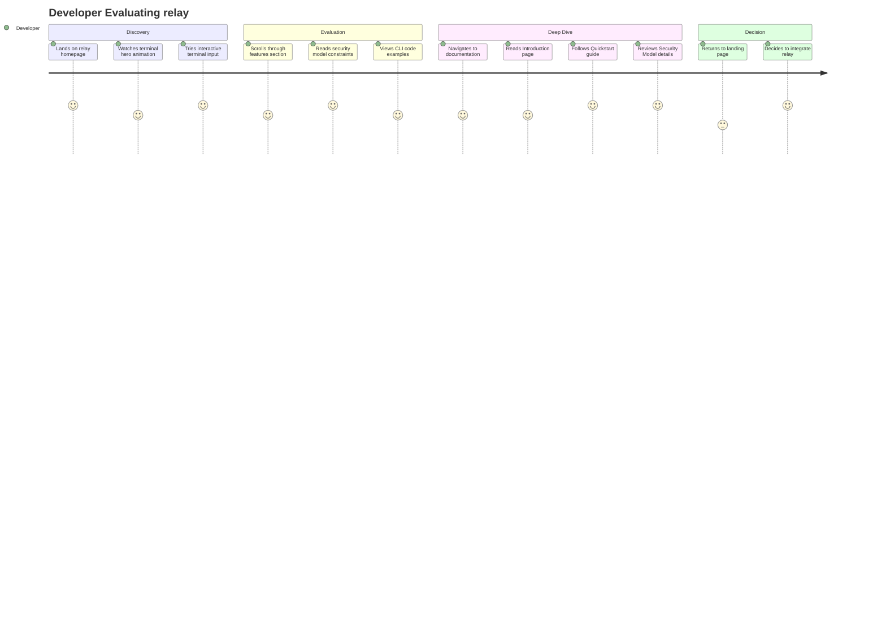
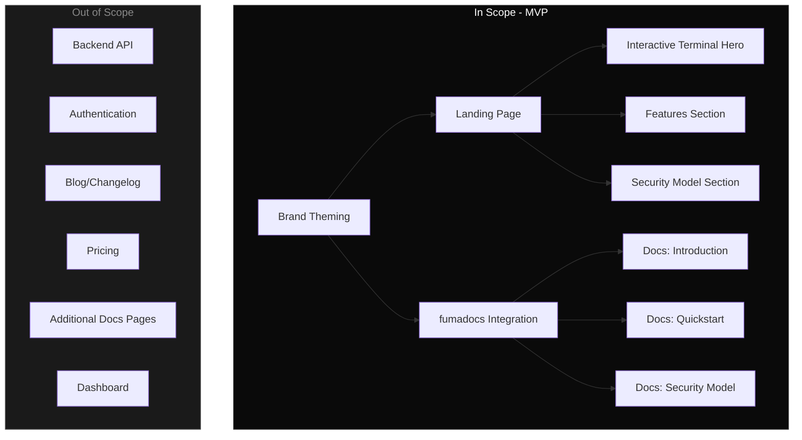

# PRD: relay Landing Page and Documentation Site

## Overview

### One-line Summary
A dark-first landing page with an interactive terminal hero and a minimal fumadocs documentation site for relay, the external agent service that isolates execution from communication.

### Background
relay needs a web presence that communicates its value proposition to technical founders and agent builders. The product has a clear brand identity (terminal aesthetic, glass panels, monospace typography) and a defined CLI interface. The site must serve two purposes: (1) a landing page that immediately demonstrates what relay does through an interactive terminal experience, and (2) a lean documentation site covering only core concepts. The documentation is aspirational, documenting the intended CLI interface from the brand spec before full implementation.

## User Stories

### Primary Users
- **Technical founders** building agent-based products who need secure external communication
- **Agent builders** orchestrating LLM workflows who need capability isolation
- **DevOps/security-minded developers** concerned about agent security boundaries

### User Stories
```
As a technical founder
I want to understand relay's value proposition in under 30 seconds
So that I can decide if it solves my agent communication isolation problem
```

```
As an agent builder
I want to see relay's CLI interface and security model
So that I can evaluate how it fits into my existing agent orchestration stack
```

```
As a developer evaluating relay
I want to follow a quickstart guide
So that I can understand the setup process and time-to-value
```

### Use Cases
1. A developer lands on the homepage, sees the terminal hero typing out relay's core promise, and immediately grasps the product concept
2. A technical founder explores the features and security sections to validate relay meets their isolation requirements
3. An agent builder navigates to the docs to read about the security model and CLI commands before integrating

## Functional Requirements

### Must Have (MVP)

- [ ] **Landing page with interactive terminal hero**
  - AC: Hero section displays typing animation rendering the brand-spec prompt lines ("> create an external agent", "> that can talk to users", "> without touching my system") followed by an interactive input field ("$ describe your use case...")
  - AC: Terminal renders a structured CLI response when user submits input
  - AC: Animation completes within 4 seconds on page load

- [ ] **Features section on landing page**
  - AC: Displays relay capabilities (interviews, group interviews, pull command, logging) with CLI code examples in monospace blocks
  - AC: Each feature shows its CLI invocation matching brand spec syntax

- [ ] **Security model section on landing page**
  - AC: Clearly communicates hard constraints (no file access, no code execution, no internal APIs, no role escalation)
  - AC: Shows the structured data bridge schema between core agent and relay

- [ ] **Glass + terminal visual design system**
  - AC: Dark-first design using brand palette (background #0a0a0a/#111, glass surfaces with backdrop-blur, monospace typography via JetBrains Mono font stack)
  - AC: Glass card components with semi-transparent bg + backdrop-blur + subtle border (rgba(255,255,255,0.1))
  - AC: No bright saturated colors; accent uses muted blue/cyan for interactive elements only

- [ ] **Documentation site using fumadocs (3 pages)**
  - AC: Introduction page covering what relay is, the problem it solves, and product principles
  - AC: Quickstart page documenting the intended CLI interface with example commands and expected outputs
  - AC: Security Model page detailing capability isolation, hard constraints, and the structured data bridge schema
  - AC: All docs pages use fumadocs framework with relay brand theming applied

- [ ] **Responsive layout**
  - AC: Landing page and docs render correctly on mobile (360px), tablet (768px), and desktop (1280px+)
  - AC: Terminal hero remains functional and readable on all breakpoints

### Should Have
- [ ] Copy-to-clipboard on CLI code examples
- [ ] Subtle scroll-triggered animations on feature cards (fade-in, not distracting)

### Could Have
- [ ] Channel badges (WhatsApp, Voice) with muted iconography in the features section
- [ ] Light mode toggle (secondary to dark-first default)

### Won't Have (this release)
- Backend API integration
- User authentication or dashboard
- Blog or changelog
- Pricing page
- Additional docs pages beyond Introduction, Quickstart, Security Model

### Out of Scope
- Backend API integration: Landing page is static, no live relay service calls
- User authentication or dashboard: Not part of the marketing site
- Blog or changelog: Keep the site minimal per user requirement
- Pricing page: Not defined yet
- Additional docs pages beyond Introduction, Quickstart, Security Model
- Implementation phases or task decomposition (handled separately)

## Non-Functional Requirements

### Performance
- Largest Contentful Paint (LCP): under 2.5 seconds
- Interaction to Next Paint (INP): under 200ms
- Cumulative Layout Shift (CLS): under 0.1
- Terminal animation frame rate: 60fps

### Reliability
- Static site: 99.9% availability via Vercel hosting
- No runtime dependencies for landing page content

### Security
- No user data collection on MVP landing page
- No third-party analytics scripts in initial release
- Content Security Policy headers configured

### Scalability
- Static generation (SSG) for all pages via Next.js
- fumadocs content sourced from MDX files (easy to extend later)

## Success Criteria

### Quantitative Metrics
1. Page load time (LCP) under 2.5 seconds on 3G connection
2. Lighthouse performance score of 90+ on landing page
3. All 3 documentation pages render correctly with fumadocs navigation
4. Zero layout shift during terminal hero animation

### Qualitative Metrics
1. A technical developer can understand relay's value proposition within 30 seconds of landing
2. The terminal hero interaction feels native and responsive, matching the "internal tool" brand voice
3. Documentation reads at Vercel-level quality: clean structure, scannable, no fluff

## Technical Considerations

### Dependencies
- Next.js 16 (already in apps/web)
- React 19 (already in apps/web)
- Tailwind CSS v4 (already in apps/web)
- [fumadocs](https://fumadocs.dev) v16 for documentation framework (compatible with Next.js 16+)
- JetBrains Mono font (loaded via Google Fonts or self-hosted)

### Constraints
- Must live within the existing monorepo at `apps/web`
- fumadocs must integrate with the existing Next.js app router setup
- Brand guidelines are fixed (see `.claude/skills/relay-brand/references/brand.md`)
- Documentation content is aspirational (CLI interface not yet fully implemented)
- Keep total page count minimal: 1 landing page + 3 docs pages

### Assumptions
- Vercel will be the deployment target
- fumadocs v16 is stable and compatible with Next.js 16 + React 19
- Users will primarily access the site on desktop (developer audience)
- The CLI interface documented matches the intended final API surface

### Risks and Mitigation
| Risk | Impact | Probability | Mitigation |
|------|--------|-------------|------------|
| fumadocs theming conflicts with relay brand | Medium | Medium | Isolate brand CSS variables; use fumadocs theme customization API |
| Terminal animation performance on low-end devices | Low | Low | Use CSS animations over JS where possible; provide reduced-motion fallback |
| Aspirational docs become outdated as CLI changes | Medium | Medium | Keep docs minimal (3 pages); mark as "Preview" where appropriate |

## Undetermined Items

- **Terminal hero response mechanism**: The interactive terminal input will render a hardcoded structured response (not LLM-backed) to avoid backend dependency. Response shows what relay will do based on the brand spec pattern.
- **fumadocs v16 + Next.js 16 compatibility**: Assumed stable; validate with a spike during early implementation.

## User Journey



## Scope Boundary



## Appendix

### References
- [relay Brand Reference](/.claude/skills/relay-brand/references/brand.md)
- [fumadocs Documentation](https://fumadocs.dev)
- [fumadocs v16 Blog Post](https://fumadocs.dev/blog/v16)
- [Next.js 16 Documentation](https://nextjs.org/docs)

### Glossary
- **relay**: An external-facing conversational agent that isolates execution power from communication power (always lowercase)
- **fumadocs**: A React.js documentation framework optimized for Next.js, supporting App Router and MDX content
- **Capability Isolation**: The principle that the core agent (with full system access) and the relay agent (conversation-only) share no execution context
- **Glass Panel**: A UI component pattern using semi-transparent backgrounds with CSS backdrop-blur to create a frosted glass effect
- **Aspirational Docs**: Documentation written for intended CLI interface behavior before full implementation is complete
