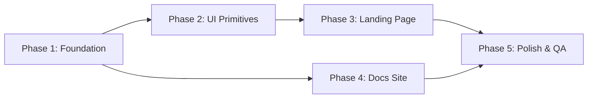
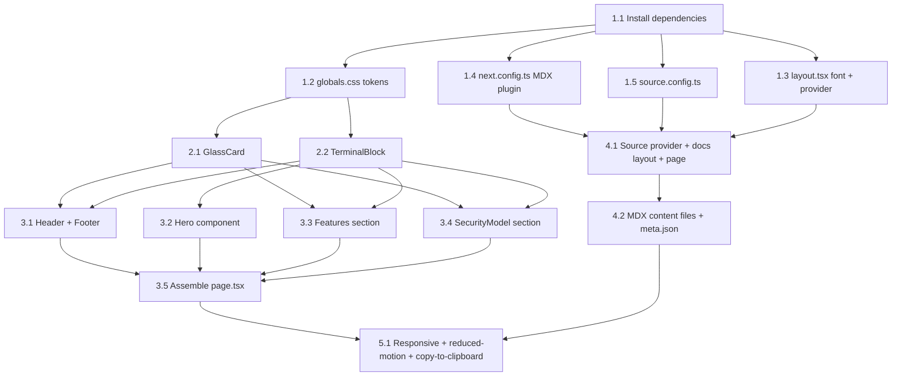

# Work Plan: relay Landing Page and Documentation Site

Created Date: 2026-02-20
Type: feature
Estimated Duration: 2-3 days
Estimated Impact: ~20 files (6 modified, ~14 new)
Related Issue/PR: N/A

## Related Documents
- Design Doc: [docs/design.md](/docs/design.md)
- PRD: [docs/prd.md](/docs/prd.md)

## Objective
Build the relay web presence: a dark-first landing page with interactive terminal hero and a 3-page fumadocs documentation site, all within the existing `apps/web` monorepo workspace.

## Background
The current `apps/web` contains only Next.js boilerplate. This plan implements the full landing page and docs site as specified in the Design Doc, following a vertical slice strategy ordered by technical dependencies.

## Risks and Countermeasures

### Technical Risks
- **Risk**: fumadocs v16 compatibility with Next.js 16 in monorepo
  - **Impact**: High -- blocks entire docs site (Phase 4)
  - **Countermeasure**: Validate during Phase 1 foundation setup; if incompatible, fall back to `@next/mdx` with manual navigation
- **Risk**: fumadocs CSS overrides conflict with relay brand tokens
  - **Impact**: Medium -- visual inconsistency in docs pages
  - **Countermeasure**: Use CSS variable overrides (`--color-fd-*`) as specified in Design Doc; isolate fumadocs imports in `globals.css`

### Schedule Risks
- **Risk**: Hero animation complexity exceeds estimate
  - **Impact**: Low -- delays Phase 3
  - **Countermeasure**: Implement static version first, add animation incrementally

## Phase Structure

## Task Dependencies

## Implementation Phases

### Phase 1: Foundation (Estimated commits: 1)
**Purpose**: Install dependencies, configure build pipeline, establish brand tokens and layout.

#### Tasks
- [ ] 1.1 Install dependencies: `fumadocs-core@^16`, `fumadocs-ui@^16`, `fumadocs-mdx@^14`, `shiki@^3` in `apps/web/package.json`
- [ ] 1.2 Replace `globals.css` with relay brand tokens + fumadocs CSS imports + glass utility variables
- [ ] 1.3 Update `layout.tsx`: swap Geist fonts for JetBrains Mono, wrap with `RootProvider`, set `dark` class on `<html>`
- [ ] 1.4 Update `next.config.ts`: wrap config with `createMDX()` from `fumadocs-mdx/next`
- [ ] 1.5 Create `apps/web/source.config.ts` with `defineDocs({ dir: "content/docs" })`; add `@/.source` path alias to `tsconfig.json`

#### Phase Completion Criteria
- [ ] `npm run build -w apps/web` succeeds (L3)
- [ ] No TypeScript errors in modified files
- [ ] Brand tokens visible in rendered page (dark background, monospace font)

#### Operational Verification
1. Run `npm run build -w apps/web` -- must succeed with fumadocs-mdx plugin active
2. Run `npm run dev -w apps/web` -- page loads with dark background (#0a0a0a) and JetBrains Mono font
3. No TypeScript errors in `layout.tsx`, `globals.css`, `next.config.ts`

---

### Phase 2: UI Primitives (Estimated commits: 1)
**Purpose**: Create reusable GlassCard and TerminalBlock components used across landing page and features.

**Depends on**: Phase 1 (brand tokens in CSS)

#### Tasks
- [ ] 2.1 Create `apps/web/src/components/ui/glass-card.tsx` -- server component with `bg-glass-bg`, `backdrop-blur`, `border-glass-border`
- [ ] 2.2 Create `apps/web/src/components/ui/terminal-block.tsx` -- server component rendering `lines: Array<{ prefix: string; text: string }>` with monospace styling

#### Phase Completion Criteria
- [ ] Both components render without errors (L3 -- build succeeds)
- [ ] GlassCard shows backdrop-blur and border styling (visual check)
- [ ] TerminalBlock renders prefixed lines in monospace (visual check)

#### Operational Verification
1. Import both components in `page.tsx` temporarily with sample data
2. Verify GlassCard has semi-transparent background + blur + border
3. Verify TerminalBlock renders `$` / `>` prefixes with monospace text

---

### Phase 3: Landing Page (Estimated commits: 2-3)
**Purpose**: Build all landing page sections and assemble them into `/` route.

**Depends on**: Phase 2 (GlassCard, TerminalBlock)

#### Tasks
- [ ] 3.1 Create `header.tsx` (server, `relay` logo + "Docs" link) and `footer.tsx` (server, copyright line)
- [ ] 3.2 Create `hero.tsx` (client component): 3-state terminal (animating -> idle -> responded), `requestAnimationFrame` typing animation, hardcoded CLI response on submit, `prefers-reduced-motion` support
- [ ] 3.3 Create `features.tsx` (server): grid of GlassCards with 4 features + CodeExample/TerminalBlock for CLI invocations
- [ ] 3.4 Create `security-model.tsx` (server): hard constraints list + structured data bridge JSON in TerminalBlock
- [ ] 3.5 Create `code-example.tsx` (server): TerminalBlock wrapper (copy button deferred to Phase 5)
- [ ] 3.6 Assemble `page.tsx`: import Header, Hero, Features, SecurityModel, Footer; replace boilerplate

#### Phase Completion Criteria
- [ ] Landing page renders at `/` with all sections visible (L1)
- [ ] Hero animation plays and input field becomes active (AC-1)
- [ ] 4 feature cards with CLI examples visible (AC-2)
- [ ] Security constraints list and JSON schema visible (AC-3)
- [ ] Brand styling correct: dark bg, glass cards, monospace, no rounded-full (AC-4)

#### Operational Verification
1. Navigate to `/` -- Hero animation plays 3 lines, completes within 4 seconds
2. Type in hero input, press Enter -- hardcoded CLI response appears
3. Scroll to Features -- 4 GlassCards with TerminalBlock code examples
4. Scroll to Security Model -- constraints list + JSON schema in TerminalBlock
5. Check Header has "relay" logo and "Docs" link; Footer has copyright

---

### Phase 4: Docs Site (Estimated commits: 1-2)
**Purpose**: Wire fumadocs source provider, create docs layout/page, and write 3 MDX content files.

**Depends on**: Phase 1 (MDX plugin, source config, RootProvider)

#### Tasks
- [ ] 4.1 Create `apps/web/src/lib/source.ts` with fumadocs `loader()` using `docs.toFumadocsSource()`
- [ ] 4.2 Create `apps/web/src/app/docs/layout.tsx` with `DocsLayout` wrapping `source.pageTree`
- [ ] 4.3 Create `apps/web/src/app/docs/[[...slug]]/page.tsx` with `DocsPage`, `DocsBody`, `generateStaticParams`
- [ ] 4.4 Create `apps/web/content/docs/meta.json`: `["index", "quickstart", "security-model"]`
- [ ] 4.5 Create `apps/web/content/docs/index.mdx` (Introduction)
- [ ] 4.6 Create `apps/web/content/docs/quickstart.mdx` (Quickstart with CLI examples)
- [ ] 4.7 Create `apps/web/content/docs/security-model.mdx` (Security Model details)

#### Phase Completion Criteria
- [ ] `/docs` renders Introduction with sidebar showing 3 pages (AC-5)
- [ ] `/docs/quickstart` and `/docs/security-model` navigable via sidebar (AC-5)
- [ ] TOC renders on desktop; sidebar is responsive (AC-5, AC-6)
- [ ] Docs pages use relay brand theming (AC-5)
- [ ] `npm run build -w apps/web` succeeds with all MDX pages generated

#### Operational Verification
1. Navigate to `/docs` -- Introduction page renders with sidebar (3 entries)
2. Click "Quickstart" in sidebar -- page loads with CLI examples
3. Click "Security Model" in sidebar -- page loads with constraints detail
4. Verify TOC on desktop, sidebar collapse on mobile
5. Verify dark background and monospace font on all docs pages

---

### Phase 5: Polish and Quality Assurance (Estimated commits: 1)
**Purpose**: Responsive verification, accessibility, copy-to-clipboard, final quality gate.

**Depends on**: Phases 3 and 4

#### Tasks
- [ ] 5.1 Responsive verification: test landing page at 360px, 768px, 1280px+ (AC-6)
- [ ] 5.2 Responsive verification: test docs pages at same breakpoints (AC-6)
- [ ] 5.3 Implement `prefers-reduced-motion` on Hero: skip animation, show all lines immediately (AC-1)
- [ ] 5.4 Add copy-to-clipboard button to CodeExample (Should Have -- implement if time permits)
- [ ] 5.5 Final build verification: `npm run build -w apps/web` succeeds
- [ ] 5.6 Verify all Design Doc acceptance criteria (AC-1 through AC-6)

#### Phase Completion Criteria
- [ ] Landing page renders correctly at 360px, 768px, 1280px+ (AC-6)
- [ ] Hero functional and readable at all breakpoints (AC-6)
- [ ] Docs navigable on mobile with responsive sidebar (AC-6)
- [ ] `prefers-reduced-motion` shows all hero lines immediately (AC-1)
- [ ] Build succeeds with zero TypeScript errors
- [ ] All acceptance criteria AC-1 through AC-6 satisfied

#### Operational Verification
1. Enable `prefers-reduced-motion` in browser -- hero shows all lines immediately
2. Test landing page at 360px, 768px, 1280px viewports
3. Test docs pages at same viewports -- sidebar collapses on mobile
4. Run `npm run build -w apps/web` -- succeeds
5. Lighthouse audit on landing page -- target performance score 90+

---

## Completion Criteria
- [ ] All phases completed (Phases 1-5)
- [ ] Each phase's operational verification procedures executed
- [ ] Design Doc acceptance criteria AC-1 through AC-6 satisfied
- [ ] `npm run build -w apps/web` succeeds
- [ ] Landing page renders at `/` with all sections
- [ ] Docs site renders at `/docs` with 3 navigable pages
- [ ] Responsive at 360px, 768px, 1280px+
- [ ] `prefers-reduced-motion` supported on hero

## Progress Tracking

### Phase 1: Foundation
- Start:
- Complete:
- Notes:

### Phase 2: UI Primitives
- Start:
- Complete:
- Notes:

### Phase 3: Landing Page
- Start:
- Complete:
- Notes:

### Phase 4: Docs Site
- Start:
- Complete:
- Notes:

### Phase 5: Polish and QA
- Start:
- Complete:
- Notes:

## Notes
- Phase 3 and Phase 4 can be worked in parallel after their respective dependencies are met (Phase 2 for landing, Phase 1 for docs)
- Copy-to-clipboard (task 5.4) is a Should Have -- skip if time-constrained
- All docs content is aspirational (CLI not yet implemented); mark as preview where appropriate
- No unit tests planned per Design Doc test strategy (static site with no business logic; ROI too low)
